# ORM (Object Relational Mapping) OR O/R mapping
- Lets say we have an Employee Management System. We want to manager employee information.
- Each employee has details like employeeID, name, department, and salary. You want to perform operations such as adding new employees, updating their information, retrieving details, and deleting records when employees leave.

#### Without using ORM technique
- Without using ORM, you would need to write SQL queries for each operation. For instance:
  - To add a new employee, you'd write an INSERT SQL query.
  - To update an employee's salary, you'd write an UPDATE SQL query.
  - To fetch employee details, you'd write a SELECT SQL query.
- Each operation requires careful handling of SQL syntax, data types, and potential errors.

#### With ORM
- What if the columns of a table has some mapping with objects in programming? basically could there be a class of employees as objects in your programming language. Let's say you have an Employee class with attributes like employeeID, name, department, and salary.
- So instead of writting SQL queries, we would have store the value in the object and pass that object to perform database operation.
- So thats what ORM handles this.

## What is ORM?
- Object-Relational Mapping, is a technique used in programming to map objects in your code to tables in a relational database. This mapping allows developers to interact with the database using the same object-oriented paradigms they use in their code, rather than writing raw SQL queries.


## Why ORM?
1. **Abstraction:** ORM provides a layer of abstraction over the database, which makes it easier to work with the database using object-oriented principles. You don't have to write complex SQL queries; instead, you can work with objects and methods.
2. **Convenience:** It simplifies database operations like insert, update, delete, and query by allowing you to use your programming language's syntax and features, such as classes and objects.
3. **Code Readability:** Using ORM makes the code more readable and maintainable. You define your data structure and relationships in the code, and the ORM handles the rest.
4. **Portability:** It can make it easier to switch between different types of databases (e.g., MySQL, PostgreSQL) because the ORM abstracts the specifics of each database.

- ORM (Object-Relational Mapping) techniques can be integrated with many programming languages. ORM is a general approach to bridge the gap between object-oriented programming languages and relational databases, allowing developers to work with data using objects rather than raw SQL queries.
- In the Java ecosystem, several popular ORM tools and frameworks leverage the ORM technique to facilitate database interactions. These tools are **Hibernate,JPA (Java Persistence API), TopLink and many more.**
- **ORMs have been primarily designed for relational databases (RDBMS). The concept of mapping objects to relational tables has been the core focus. This is why ORMs like Hibernate, SQLAlchemy, and Entity Framework have flourished in this domain.**

## Hibernate
- Hibernate is a Java framework that simplifies the development of Java application to interact with the database. It is an open source, lightweight, ORM (Object Relational Mapping) tool.
- By mapping Java objects to database tables, it streamlines data persistence and retrieval without the need for complex SQL queries.
- **Hibernate primarily works with Relational Database Management Systems (RDBMS). It's designed to bridge the gap between object-oriented programming languages (like Java) and relational databases.**
- Hibernate is a non-invasive framework, it means hibernate does not enforced developers to extends/implement any class or interfaces. It works only with existing class.
- Now lets use hibernate and mysql. For that we need to have its dependencies in our maven pom.xml project.

```
    <!-- https://mvnrepository.com/artifact/org.hibernate.orm/hibernate-core -->
<dependency>
    <groupId>org.hibernate.orm</groupId>
    <artifactId>hibernate-core</artifactId>
    <version>6.5.2.Final</version>
</dependency>

<!-- https://mvnrepository.com/artifact/com.mysql/mysql-connector-j -->
<dependency>
    <groupId>com.mysql</groupId>
    <artifactId>mysql-connector-j</artifactId>
    <version>8.0.33</version>
</dependency>
```

### Annotation Based Mapping

- Post dependencies are downloaded we need to define hibernation configurations. This can be done using **cfg.xml** file.
- Below we have defined hibernate cfg file. Here we are using MySQL database.

```
<?xml version="1.0" encoding="UTF-8"?>
<!DOCTYPE hibernate-configuration SYSTEM 
"http://www.hibernate.org/dtd/hibernate-configuration-3.0.dtd">
<!-- Version 8 MySQL hiberante-cfg.xml example for Hibernate 5 -->
<hibernate-configuration>
  <session-factory>
  <!-- Driver name -->
    <property name="connection.driver_class">com.mysql.cj.jdbc.Driver</property>
    <!-- property name="connection.driver_class">com.mysql.jdbc.Driver</property -->
    <property name="connection.url">jdbc:mysql://localhost:3306/myhibernatedb</property>
    <!-- 
    a "dialect" is a configuration setting that specifies the type of database you are using. 
    It tells Hibernate how to generate the appropriate SQL statements for your particular database system,
     as different databases have different SQL syntax, data types, and functions.
     -->
    <property name="dialect">org.hibernate.dialect.MySQLDialect</property>
    <property name="connection.username">root</property>
    <property name="connection.password">Meetpandya40@</property>
<!--     <property name="connection.pool_size">3</property>
 -->    <!--property name="dialect">org.hibernate.dialect.MySQLDialect</property-->
<!--     <property name="current_session_context_class">thread</property>
 -->    
 	<!-- 
 	show sql =  true states that whatever hibernate fires the query it will show in the console.
 	 -->
    <property name="show_sql">true</property>
    <property name="format_sql">true</property>
    
    <!-- 
    When we use create , it will create table , but if existing tables are there those will get deleted
    and again will get created. So it is better to use update over create. It will create only once if
    table does not exists.
     -->
    <property name="hbm2ddl.auto">update</property>
    <!-- mapping class="com.mcnz.jpa.examples.Player" / -->
  </session-factory>
</hibernate-configuration>
```

- Now using hibernate cfg file , lets test that we have properly configured it.

```
package orm.hibernate;

import org.hibernate.SessionFactory;
import org.hibernate.cfg.Configuration;

public class MainMethod {
  public static void main(String[] args) {

	  /**
	   * This line creates a new instance of the Configuration class from Hibernate.
	   * The Configuration object is used to configure Hibernate and set up its properties.
	   */
	  Configuration con=new Configuration();
	  
	  /**
	   * This line tells the Configuration object to load the configuration settings from the file
	   *  hibernateConfig.cfg.xml, located in the orm/hibernate directory.
	   * The XML file contains important settings such as database connection details, dialect, 
	   *  mappings, and other Hibernate configurations.
	   */
	  con.configure("orm/hibernate/hibernateConfig.cfg.xml");
  
	  /**
	   * The SessionFactory is a crucial object in Hibernate. It is a factory for Session objects, 
	   * which are used to interact with the database. The SessionFactory is typically created once 
	   * and used to create multiple Session instances.
	   */
	  SessionFactory ssf=con.buildSessionFactory();
	  
	  System.out.println(ssf);
			  
  }
}

Output:
org.hibernate.internal.SessionFactoryImpl@17273273
```

- Lets create a Student class.

```
package orm.hibernate;

import jakarta.persistence.Entity;
import jakarta.persistence.Id;
import jakarta.persistence.Table;

@Entity
@Table(name="Student_data")
public class Student {
	
	@Id
	private int id;
	
	private String name;
	private String city;
	
	public int getId() {
		return id;
	}
	public void setId(int id) {
		this.id = id;
	}
	public String getName() {
		return name;
	}
	public void setName(String name) {
		this.name = name;
	}
	public String getCity() {
		return city;
	}
	public void setCity(String city) {
		this.city = city;
	}
	
	@Override
	public String toString() {
		return "Student [id=" + id + ", name=" + name + ", city=" + city + "]";
	}
	
	
	
}

```

- Here in this approach we have used annotation to define relation between object and database tables. The `@Entity` annotation is used to specify that a given class is an entity and is mapped to a database table. This tells the ORM framework (like Hibernate) that objects of this class should be persisted in the database.
- The `@Id` annotation is used to denote the primary key of an entity. The primary key is a unique identifier for each entity instance.
- `@Table` tells hibernate if there is no table with name **Student_data** then create it.
- Currently there are no tables under database **myhibernatedb**.


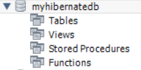

- So we have defined our entity and create instance variables for it. Now we need to configure this entity into our cfg.xml file or map this entity into our cfg.xml file.

```
<?xml version="1.0" encoding="UTF-8"?>
<!DOCTYPE hibernate-configuration SYSTEM 
"http://www.hibernate.org/dtd/hibernate-configuration-3.0.dtd">
<!-- Version 8 MySQL hiberante-cfg.xml example for Hibernate 5 -->
<hibernate-configuration>
  <session-factory>
  <!-- Driver name -->
    <property name="connection.driver_class">com.mysql.cj.jdbc.Driver</property>
    <!-- property name="connection.driver_class">com.mysql.jdbc.Driver</property -->
    <property name="connection.url">jdbc:mysql://localhost:3306/myhibernatedb</property>
    <!-- 
    a "dialect" is a configuration setting that specifies the type of database you are using. 
    It tells Hibernate how to generate the appropriate SQL statements for your particular database system,
     as different databases have different SQL syntax, data types, and functions.
     -->
    <property name="dialect">org.hibernate.dialect.MySQLDialect</property>
    <property name="connection.username">root</property>
    <property name="connection.password">Meetpandya40@</property>
<!--     <property name="connection.pool_size">3</property>
 -->    <!--property name="dialect">org.hibernate.dialect.MySQLDialect</property-->
<!--     <property name="current_session_context_class">thread</property>
 -->    
 	<!-- 
 	show sql =  true states that whatever hibernate fires the query it will show in the console.
 	 -->
    <property name="show_sql">true</property>
    <property name="format_sql">true</property>
    
    <!-- 
    When we use create , it will create table , but if existing tables are there those will get deleted
    and again will get created. So it is better to use update over create. It will create only once if
    table does not exists.
     -->
    <property name="hbm2ddl.auto">update</property>
    <!-- mapping class="com.mcnz.jpa.examples.Player" / -->
    <mapping class="orm.hibernate.Student"/>
  </session-factory>
</hibernate-configuration>
```

-  Now lets create table and insert some values into it. So uptil we have create one defined hibernate configuration in a cfg.xml, loaded configuratin and SessionFactory for hibernate and created an entity. Now to perform any database operation using java we need to have a session. Now when we create session from there we need to derived a transaction, database operations works transaction.

```
package orm.hibernate;

import org.hibernate.Session;
import org.hibernate.SessionFactory;
import org.hibernate.Transaction;
import org.hibernate.cfg.Configuration;

public class MainMethod {
  public static void main(String[] args) {

	  /**
	   * This line creates a new instance of the Configuration class from Hibernate.
	   * The Configuration object is used to configure Hibernate and set up its properties.
	   */
	  Configuration con=new Configuration();
	  
	  /**
	   * This line tells the Configuration object to load the configuration settings from the file
	   *  hibernateConfig.cfg.xml, located in the orm/hibernate directory.
	   * The XML file contains important settings such as database connection details, dialect, 
	   *  mappings, and other Hibernate configurations.
	   */
	  con.configure("orm/hibernate/hibernateConfig.cfg.xml");
  
	  /**
	   * The SessionFactory is a crucial object in Hibernate. It is a factory for Session objects, 
	   * which are used to interact with the database. The SessionFactory is typically created once 
	   * and used to create multiple Session instances.
	   */
	  SessionFactory ssf=con.buildSessionFactory();
	  
	  Student st=new Student();
	  st.setId(1);
	  st.setName("Harsh");
	  st.setCity("Mumbai");
	  
	  /**
	   * Created a session
	   */
	  Session session=ssf.openSession();
	  
	  /**
	   * Using session we created a new transaction
	   */
	  Transaction tx=session.beginTransaction();
	  
	  /**
	   * Save or inserted student object
	   */
	  session.save(st);
	  
	  /**
	   * Committed the transaction.
	   */
	  tx.commit();
	  
	  /**
	   * Close the resources
	   */
	  
	  session.close();
	  
			  
  }
}

Output:
Hibernate: 
    create table Student_data (
        id integer not null,
        city varchar(255),
        name varchar(255),
        primary key (id)
    ) engine=InnoDB
Hibernate: 
    insert 
    into
        Student_data
        (city, name, id) 
    values
        (?, ?, ?)
```

- Post execution of main method, we can see a new table is created and a value is insert.

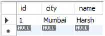

- Some commonly used annotations are listed below
1. `@Entity`: Marks the class as a Hibernate entity, mapping it to a database table.
2. `@Id`: Specifies the primary key of the entity.
3. `@GeneratedValue`: Configures the way of incrementing the specified column (in this case, the primary key).Here, GenerationType.IDENTITY uses the database's identity column feature.
4. `@Column`: Maps the field to a database column with options like name, nullable, unique, etc.
5. `@Transient`: Indicates that the field is not to be persisted in the database.
6. `@Temporal`: Specifies the date/time type (DATE, TIME, or TIMESTAMP) for a Date field in the database.
7. `@Lob`: Designates a field as a Large Object, suitable for large binary or text data.
8. `@Enumerated`: Maps an enum type to a database column. EnumType.STRING stores the enum name as a string.

- Let us try all above annotation by creating a class of Address. So lets say we want to create a address table which stores student address details. 

```
package orm.hibernate;

import java.util.Date;

import jakarta.persistence.*;

/**
 * By specify entity annotation with name , hibernate will create table (if it not exists) by
 * the provided name i.e student_address_data
 */
@Entity(name="student_address_data")
public class Address {

	/**
	 * Made this object as primary and
	 * kept auto incremental value for it
	 */
	@Id
	@GeneratedValue(strategy = GenerationType.IDENTITY)
	private int unique_identifier;
	
	/**
	 * Hibernate will create a column with name first_line_address instead of address1
	 * with max length of 50
	 */
	@Column(name="first_line_address",length = 50)
	private String address1;
	
	@Column(name="second_line_address",length = 50)
	private String address2;
	
	/**
	 * Stores complete timestamp details
	 * in the column name details_creation_date
	 */
	@Temporal(TemporalType.TIMESTAMP)
	@Column(name="details_creation_date")
	private Date stores_timestamp;
	
	/**
	 * Since we are storing timestamp, we don't required 
	 * to store the date again, these parameter may be used
	 * for any other computation purpose
	 */
	@Transient
	private Date stores_date;
	
	/**
	 * Stores student photo
	 */
	@Column(name="student_photo")
	@Lob
	private byte[] photo;
	
	/**
	 * To store Enum types of variables
	 */
    @Enumerated(EnumType.STRING)
    @Column(name="form_status")
	private String form;
    
    public enum String{
    	PENDING,
    	SUBMITED;
    }

	public int getUnique_identifier() {
		return unique_identifier;
	}

	public void setUnique_identifier(int unique_identifier) {
		this.unique_identifier = unique_identifier;
	}

	public String getAddress1() {
		return address1;
	}

	public void setAddress1(String address1) {
		this.address1 = address1;
	}

	public String getAddress2() {
		return address2;
	}

	public void setAddress2(String address2) {
		this.address2 = address2;
	}

	public Date getStores_timestamp() {
		return stores_timestamp;
	}

	public void setStores_timestamp(Date stores_timestamp) {
		this.stores_timestamp = stores_timestamp;
	}

	public Date getStores_date() {
		return stores_date;
	}

	public void setStores_date(Date stores_date) {
		this.stores_date = stores_date;
	}

	public byte[] getPhoto() {
		return photo;
	}

	public void setPhoto(byte[] photo) {
		this.photo = photo;
	}

	public String getForm() {
		return form;
	}

	public void setForm(String form) {
		this.form = form;
	}
  
	@Override
	public String toString() {
		return "Address [unique_identifier=" + unique_identifier + ", address1=" + address1 + ", address2=" + address2
				+ ", stores_timestamp=" + stores_timestamp + ", stores_date=" + stores_date + ", photo="
				+ Arrays.toString(photo) + ", form=" + form + "]";
	}
}
```
- We have created our entity now we need to defined that this entity should be considered by hibernate .

```
<?xml version="1.0" encoding="UTF-8"?>
<!DOCTYPE hibernate-configuration SYSTEM 
"http://www.hibernate.org/dtd/hibernate-configuration-3.0.dtd">
<!-- Version 8 MySQL hiberante-cfg.xml example for Hibernate 5 -->
<hibernate-configuration>
  <session-factory>
  <!-- Driver name -->
    <property name="connection.driver_class">com.mysql.cj.jdbc.Driver</property>
    <!-- property name="connection.driver_class">com.mysql.jdbc.Driver</property -->
    <property name="connection.url">jdbc:mysql://localhost:3306/myhibernatedb</property>
    <!-- 
    a "dialect" is a configuration setting that specifies the type of database you are using. 
    It tells Hibernate how to generate the appropriate SQL statements for your particular database system,
     as different databases have different SQL syntax, data types, and functions.
     -->
    <property name="dialect">org.hibernate.dialect.MySQLDialect</property>
    <property name="connection.username">root</property>
    <property name="connection.password">Meetpandya40@</property>
<!--     <property name="connection.pool_size">3</property>
 -->    <!--property name="dialect">org.hibernate.dialect.MySQLDialect</property-->
<!--     <property name="current_session_context_class">thread</property>
 -->    
 	<!-- 
 	show sql =  true states that whatever hibernate fires the query it will show in the console.
 	 -->
    <property name="show_sql">true</property>
    <property name="format_sql">true</property>
    
    <!-- 
    When we use create , it will create table , but if existing tables are there those will get deleted
    and again will get created. So it is better to use update over create. It will create only once if
    table does not exists.
     -->
    <property name="hbm2ddl.auto">update</property>
    <!-- mapping class="com.mcnz.jpa.examples.Player" / -->
    <mapping class="orm.hibernate.annotation.Student"/>
    <mapping class="orm.hibernate.annotation.Address"/>
  </session-factory>
</hibernate-configuration>
```

- Post running our main method , we can see table is created and data is inserted.

```
package orm.hibernate.annotation;

import java.io.FileInputStream;
import java.io.FileNotFoundException;
import java.io.IOException;
import java.util.Date;

import org.hibernate.Session;
import org.hibernate.SessionFactory;
import org.hibernate.Transaction;
import org.hibernate.cfg.Configuration;

import orm.hibernate.annotation.Address.formStatus;

public class MainMethod {
  public static void main(String[] args) {

	  /**
	   * This line creates a new instance of the Configuration class from Hibernate.
	   * The Configuration object is used to configure Hibernate and set up its properties.
	   */
	  Configuration con=new Configuration();
	  
	  /**
	   * This line tells the Configuration object to load the configuration settings from the file
	   *  hibernateConfig.cfg.xml, located in the orm/hibernate directory.
	   * The XML file contains important settings such as database connection details, dialect, 
	   *  mappings, and other Hibernate configurations.
	   */
	  con.configure("orm/hibernate/annotation/hibernateConfig.cfg.xml");
  
	  /**
	   * The SessionFactory is a crucial object in Hibernate. It is a factory for Session objects, 
	   * which are used to interact with the database. The SessionFactory is typically created once 
	   * and used to create multiple Session instances.
	   */
	  SessionFactory ssf=con.buildSessionFactory();
	  
	  /**
	   * Created a session
	   */
	  Session session=ssf.openSession();
	  
	  /**
	   * Using session we created a new transaction
	   */
	  Transaction tx=session.beginTransaction();
	  
	  Address address=new Address();
	  address.setAddress1("abc");
	  address.setAddress2("xyz");
	  address.setForm(formStatus.PENDING);
	  address.setStores_date(new Date());
	  address.setStores_timestamp(new Date());
	  try {
		FileInputStream fis=new FileInputStream("src/main/java/orm/hibernate/annotation/image.png");
		try {
			byte[] image=new byte[fis.available()];
			address.setPhoto(image);
		} catch (IOException e) {
			// TODO Auto-generated catch block
			e.printStackTrace();
		}
	} catch (FileNotFoundException e) {
		// TODO Auto-generated catch block
		e.printStackTrace();
	}
	  
	  session.save(address);
	  /**
	   * Committed the transaction.
	   */
	  tx.commit();
	  
	  /**
	   * Close the resources
	   */
	  
	  session.close();
			  
  }
}


Output:
Hibernate: 
    create table student_address_data (
        unique_identifier integer not null auto_increment,
        first_line_address varchar(50),
        second_line_address varchar(50),
        form_status enum ('PENDING','SUBMITED'),
        student_photo mediumblob,
        details_creation_date datetime(6),
        primary key (unique_identifier)
    ) engine=InnoDB
Hibernate: 
    insert 
    into
        student_address_data
        (first_line_address, second_line_address, form_status, student_photo, details_creation_date) 
    values
        (?, ?, ?, ?, ?)
```

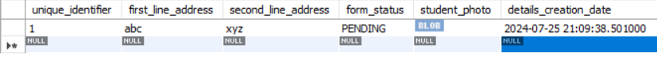

- Now lets say we want to get rows or load rows, how to do it?, hibernate provides **get()** and **load()** method both. The get and load methods in Hibernate are used to fetch entities based on their primary key (identifier).

```
package orm.hibernate.annotation;

import java.io.FileInputStream;
import java.io.FileNotFoundException;
import java.io.IOException;
import java.util.Date;

import org.hibernate.Session;
import org.hibernate.SessionFactory;
import org.hibernate.Transaction;
import org.hibernate.cfg.Configuration;

import orm.hibernate.annotation.Address.formStatus;

public class MainMethod {
  public static void main(String[] args) {

	  /**
	   * This line creates a new instance of the Configuration class from Hibernate.
	   * The Configuration object is used to configure Hibernate and set up its properties.
	   */
	  Configuration con=new Configuration();
	  
	  /**
	   * This line tells the Configuration object to load the configuration settings from the file
	   *  hibernateConfig.cfg.xml, located in the orm/hibernate directory.
	   * The XML file contains important settings such as database connection details, dialect, 
	   *  mappings, and other Hibernate configurations.
	   */
	  con.configure("orm/hibernate/annotation/hibernateConfig.cfg.xml");
  
	  /**
	   * The SessionFactory is a crucial object in Hibernate. It is a factory for Session objects, 
	   * which are used to interact with the database. The SessionFactory is typically created once 
	   * and used to create multiple Session instances.
	   */
	  SessionFactory ssf=con.buildSessionFactory();
	  
	  /**
	   * Created a session
	   */
	  Session session=ssf.openSession();

	  /**
	   * Using Get Method, fetch based on primary key as its where clause
	   */
	  Address ad=session.get(Address.class, 1);
	  System.out.println(ad.getAddress1()+" "+ad.getAddress2());
	  /**
	   * Using Load Method, fetch based on primary key as its where clause
	   */
	  Address ad1=session.load(Address.class, 1);
	  System.out.println(ad1.getAddress1()+" "+ad1.getAddress2());
	  
	  /**
	   * Close the resources
	   */
	  
	  session.close();
			  
  }
}


Output:
Hibernate: 
    alter table student_address_data 
       modify column student_photo mediumblob
Hibernate: 
    select
        a1_0.unique_identifier,
        a1_0.first_line_address,
        a1_0.second_line_address,
        a1_0.form_status,
        a1_0.student_photo,
        a1_0.details_creation_date 
    from
        student_address_data a1_0 
    where
        a1_0.unique_identifier=?
abc xyz
abc xyz
```

- Post execution of above method, we are able to retrieve data. If you observe, both get and load method provides the data, then why there are two different methods?
- In Hibernate, you can retrieve rows (or entities) from the database using the Session interface's load and get methods. These methods are used to fetch an entity based on its primary key. While both serve similar purposes, they have some differences in behavior:


| Feature             | **load**                              | **get**                               |
|---------------------|-------------------------------------|-------------------------------------|
| Return Type         | Proxy or entity. The load method returns a proxy object, not the actual entity object. A proxy is a lightweight placeholder that stands in for the actual object.        | Actual entity or `null`             |
| Database Hit        | Deferred until a property is accessed | Immediate                           |
| Exception on Not Found | Throws `ObjectNotFoundException` | Returns `null`                      |
| Use Case            | When the entity is expected to exist | When the entity may or may not exist |
| Performance         | May improve performance by delaying the database hit. The actual object is only retrieved from the database when it is needed, such as when a method of the object is called or a property is accessed. This technique is known as “lazy loading” and it is used to improve the performance of Hibernate by avoiding unnecessary database queries. | involves database hit if object does not exists in Session cache and return a fully object which may include several database call  |


- In java, one class may be dependent on another class. So in such case we need to embedded class. The `@Embedded` annotation in Hibernate is used to include an embeddable class (`@Embeddable`) into another entity. In simple terms, it means that the fields of the embedded class are treated as if they were fields of the containing entity itself, but they are logically grouped together.
- So lets say we have an Employee class.

```
package orm.hibernate.annotation;

import jakarta.persistence.*;

@Entity
public class Employee {

	private String empid;
	private String deptname;

	@Embedded
	private EmployeeAddress empAddr;
	public String getEmpid() {
		return empid;
	}
	public void setEmpid(String empid) {
		this.empid = empid;
	}
	public String getDeptname() {
		return deptname;
	}
	public void setDeptname(String deptname) {
		this.deptname = deptname;
	}
	public EmployeeAddress getEmpAddr() {
		return empAddr;
	}
	public void setEmpAddr(EmployeeAddress empAddr) {
		this.empAddr = empAddr;
	}
	
	
}
```

- Here the Employee class is dependent on EmployeeAddress class. So we need to embedded EmployeeAddress class with Employee class.

```
package orm.hibernate.annotation;

import jakarta.persistence.Embeddable;

@Embeddable
public class EmployeeAddress {

	private String address1;
	private String address2;
	public String getAddress1() {
		return address1;
	}
	public void setAddress1(String address1) {
		this.address1 = address1;
	}
	public String getAddress2() {
		return address2;
	}
	public void setAddress2(String address2) {
		this.address2 = address2;
	}
	
	
}
```

- Below is the hibernate configuration xml file.

```
<?xml version="1.0" encoding="UTF-8"?>
<!DOCTYPE hibernate-configuration SYSTEM 
"http://www.hibernate.org/dtd/hibernate-configuration-3.0.dtd">
<!-- Version 8 MySQL hiberante-cfg.xml example for Hibernate 5 -->
<hibernate-configuration>
  <session-factory>
  <!-- Driver name -->
    <property name="connection.driver_class">com.mysql.cj.jdbc.Driver</property>
    <!-- property name="connection.driver_class">com.mysql.jdbc.Driver</property -->
    <property name="connection.url">jdbc:mysql://localhost:3306/myhibernatedb</property>
    <!-- 
    a "dialect" is a configuration setting that specifies the type of database you are using. 
    It tells Hibernate how to generate the appropriate SQL statements for your particular database system,
     as different databases have different SQL syntax, data types, and functions.
     -->
    <property name="dialect">org.hibernate.dialect.MySQLDialect</property>
    <property name="connection.username">root</property>
    <property name="connection.password">Meetpandya40@</property>
<!--     <property name="connection.pool_size">3</property>
 -->    <!--property name="dialect">org.hibernate.dialect.MySQLDialect</property-->
<!--     <property name="current_session_context_class">thread</property>
 -->    
 	<!-- 
 	show sql =  true states that whatever hibernate fires the query it will show in the console.
 	 -->
    <property name="show_sql">true</property>
    <property name="format_sql">true</property>
    
    <!-- 
    When we use create , it will create table , but if existing tables are there those will get deleted
    and again will get created. So it is better to use update over create. It will create only once if
    table does not exists.
     -->
    <property name="hbm2ddl.auto">create</property>
    <!-- mapping class="com.mcnz.jpa.examples.Player" / -->
    <mapping class="orm.hibernate.annotation.Student"/>
    <mapping class="orm.hibernate.annotation.Address"/>
    <mapping class="orm.hibernate.annotation.Employee"/>
  </session-factory>
</hibernate-configuration>
```

- Post execution of main method, we create table with name employee which includes object columns of employee as well as employeeaddress in a single table employee.

```
package orm.hibernate.annotation;

import java.io.FileInputStream;
import java.io.FileNotFoundException;
import java.io.IOException;
import java.util.Date;

import org.hibernate.Session;
import org.hibernate.SessionFactory;
import org.hibernate.Transaction;
import org.hibernate.cfg.Configuration;

import orm.hibernate.annotation.Address.formStatus;

public class MainMethod {
  public static void main(String[] args) {

	  /**
	   * This line creates a new instance of the Configuration class from Hibernate.
	   * The Configuration object is used to configure Hibernate and set up its properties.
	   */
	  Configuration con=new Configuration();
	  
	  /**
	   * This line tells the Configuration object to load the configuration settings from the file
	   *  hibernateConfig.cfg.xml, located in the orm/hibernate directory.
	   * The XML file contains important settings such as database connection details, dialect, 
	   *  mappings, and other Hibernate configurations.
	   */
	  con.configure("orm/hibernate/annotation/hibernateConfig.cfg.xml");
  
	  /**
	   * The SessionFactory is a crucial object in Hibernate. It is a factory for Session objects, 
	   * which are used to interact with the database. The SessionFactory is typically created once 
	   * and used to create multiple Session instances.
	   */
	  SessionFactory ssf=con.buildSessionFactory();
	  
	  /**
	   * Created a session
	   */
	  Session session=ssf.openSession();
	  
	  /**
	   * Using session we created a new transaction
	   */
	  Transaction tx=session.beginTransaction();

	  Employee emp=new Employee();
	  emp.setEmpid("1");
	  emp.setDeptname("mumbai");
	  
	  EmployeeAddress empadd=new EmployeeAddress();
	  empadd.setAddress1("abc");
	  empadd.setAddress2("xyz");
	  emp.setEmpAddr(empadd);
	  System.out.println(emp.getEmpAddr().getAddress1());
	  session.save(emp);
	  
	  tx.commit();
	  
	  /**
	   * Close the resources
	   */
	  
	  session.close();
	  
	  
			  
  }
}

Output:
Hibernate: 
    create table Employee (
        address1 varchar(255),
        address2 varchar(255),
        deptname varchar(255),
        empid varchar(255) not null,
        primary key (empid)
    ) engine=InnoDB
Hibernate: 
    insert 
    into
        Employee
        (deptname, address1, address2, empid) 
    values
        (?, ?, ?, ?)
```


- Here upto we have seen all operations for a single table, lets say when we want to work with multiple tables which has relationship with each other, how shall we use hibernate over there?
- There are three types of relationships between the data you are likely to encounter at this stage in the design: one-to-one, one-to-many, and many-to-many.

#### One-to-One
- A one-to-one (1:1) relationship means that each record in Table A relates to one, and only one, record in Table B, and each record in Table B relates to one, and only one, record in Table A. Look at the following example of tables from a company's Employees database:

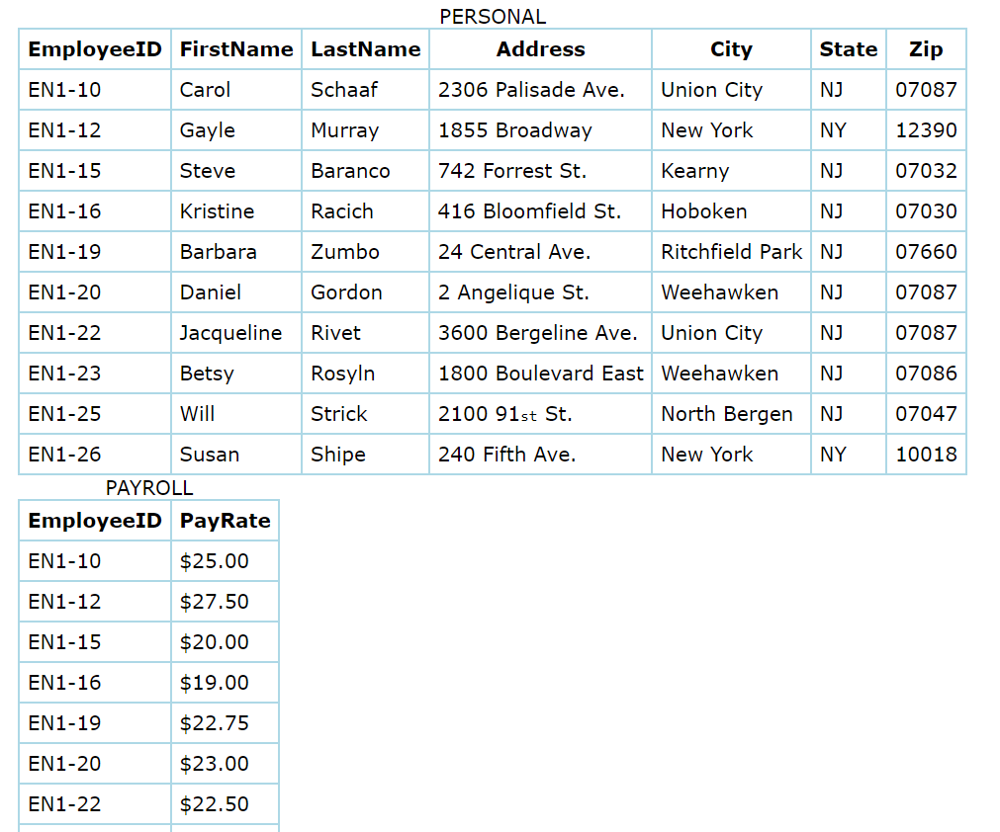

- So EmployeeID of Personal table is primary key which acts like a foreign key for Payroll table which established relationship between these two tables.
- In hibernate, we have `@OneToOne` annotation to achieve this. Lets say we have a class of Personal and Payroll.

```
package orm.hibernate.annotation.onetoone;

import jakarta.persistence.Entity;
import jakarta.persistence.Id;
import jakarta.persistence.JoinColumn;
import jakarta.persistence.OneToOne;
import jakarta.persistence.Table;

@Entity
@Table(name="one_to_one_personal")
public class Personal {

	@Id
	private int empid_personal;
	
	private String firstname;
	
	private String lastname;
	
	@OneToOne
	private Payroll payroll;


	public int getEmpid_personal() {
		return empid_personal;
	}

	public void setEmpid_personal(int empid_personal) {
		this.empid_personal = empid_personal;
	}

	public String getFirstname() {
		return firstname;
	}

	public void setFirstname(String firstname) {
		this.firstname = firstname;
	}

	public String getLastname() {
		return lastname;
	}

	public void setLastname(String lastname) {
		this.lastname = lastname;
	}

	public Payroll getPayroll() {
		return payroll;
	}

	public void setPayroll(Payroll payroll) {
		this.payroll = payroll;
	}
	
	
	
}


package orm.hibernate.annotation.onetoone;

import jakarta.persistence.*;

@Entity
@Table(name="one_to_one_payroll")
public class Payroll {

	@Id
	private int empid_of_payroll;
	
	
	private double payrate;
	
	@OneToOne
	private Personal personal;


	public double getPayrate() {
		return payrate;
	}

	public void setPayrate(double payrate) {
		this.payrate = payrate;
	}

	public int getEmpid_of_payroll() {
		return empid_of_payroll;
	}

	public void setEmpid_of_payroll(int empid_of_payroll) {
		this.empid_of_payroll = empid_of_payroll;
	}

	public Personal getPersonal() {
		return personal;
	}

	public void setPersonal(Personal personal) {
		this.personal = personal;
	}
	
	
}
```

- Below is the hibernate cfg xml file

```
<?xml version="1.0" encoding="UTF-8"?>
<!DOCTYPE hibernate-configuration SYSTEM 
"http://www.hibernate.org/dtd/hibernate-configuration-3.0.dtd">
<!-- Version 8 MySQL hiberante-cfg.xml example for Hibernate 5 -->
<hibernate-configuration>
  <session-factory>
  <!-- Driver name -->
    <property name="connection.driver_class">com.mysql.cj.jdbc.Driver</property>
    <!-- property name="connection.driver_class">com.mysql.jdbc.Driver</property -->
    <property name="connection.url">jdbc:mysql://localhost:3306/myhibernatedb</property>
    <!-- 
    a "dialect" is a configuration setting that specifies the type of database you are using. 
    It tells Hibernate how to generate the appropriate SQL statements for your particular database system,
     as different databases have different SQL syntax, data types, and functions.
     -->
    <property name="dialect">org.hibernate.dialect.MySQLDialect</property>
    <property name="connection.username">root</property>
    <property name="connection.password">Meetpandya40@</property>
<!--     <property name="connection.pool_size">3</property>
 -->    <!--property name="dialect">org.hibernate.dialect.MySQLDialect</property-->
<!--     <property name="current_session_context_class">thread</property>
 -->    
 	<!-- 
 	show sql =  true states that whatever hibernate fires the query it will show in the console.
 	 -->
    <property name="show_sql">true</property>
    <property name="format_sql">true</property>
    
    <!-- 
    When we use create , it will create table , but if existing tables are there those will get deleted
    and again will get created. So it is better to use update over create. It will create only once if
    table does not exists.
     -->
    <property name="hibernate.hbm2ddl.auto">create</property>
    <!-- mapping class="com.mcnz.jpa.examples.Player" / -->
<!--     <mapping class="orm.hibernate.annotation.Student"/>
    <mapping class="orm.hibernate.annotation.Address"/>
    <mapping class="orm.hibernate.annotation.Employee"/> -->
    <mapping class="orm.hibernate.annotation.onetoone.Personal" />
    <mapping class="orm.hibernate.annotation.onetoone.Payroll" />
  </session-factory>
</hibernate-configuration>
```
- Now lets execute the main method and see whether foreign is created or not.

```
package orm.hibernate.annotation;

import java.io.FileInputStream;
import java.io.FileNotFoundException;
import java.io.IOException;
import java.util.Date;

import org.hibernate.Session;
import org.hibernate.SessionFactory;
import org.hibernate.Transaction;
import org.hibernate.cfg.Configuration;

import orm.hibernate.annotation.Address.formStatus;
import orm.hibernate.annotation.onetoone.Payroll;
import orm.hibernate.annotation.onetoone.Personal;

public class MainMethod {
  public static void main(String[] args) {

	  /**
	   * This line creates a new instance of the Configuration class from Hibernate.
	   * The Configuration object is used to configure Hibernate and set up its properties.
	   */
	  Configuration con=new Configuration();
	  
	  /**
	   * This line tells the Configuration object to load the configuration settings from the file
	   *  hibernateConfig.cfg.xml, located in the orm/hibernate directory.
	   * The XML file contains important settings such as database connection details, dialect, 
	   *  mappings, and other Hibernate configurations.
	   */
	  con.configure("orm/hibernate/annotation/hibernateConfig.cfg.xml");
  
	  /**
	   * The SessionFactory is a crucial object in Hibernate. It is a factory for Session objects, 
	   * which are used to interact with the database. The SessionFactory is typically created once 
	   * and used to create multiple Session instances.
	   */
	  SessionFactory ssf=con.buildSessionFactory();
	  
	  /**
	   * Created a session
	   */
	  Session session=ssf.openSession();
	  
	  /**
	   * Using session we created a new transaction
	   */
	  Transaction tx=session.beginTransaction();
	  Personal ps=new Personal();
	  ps.setEmpid_personal(1);
	  ps.setFirstname("Harsh");
	  ps.setLastname("Pandya");
	  
	  Payroll py=new Payroll();
	  py.setEmpid_of_payroll(1);
	  py.setPayrate(1000);
	  ps.setPayroll(py);
	  py.setPersonal(ps);
	  
	  session.save(ps);
	  session.save(py);
	  
	  tx.commit();
	  
	  /**
	   * Close the resources
	   */
	  
	  session.close();
	  	  
  }
}

Output:
Hibernate: 
    create table one_to_one_payroll (
        empid_of_payroll integer not null,
        payrate float(53) not null,
        personal_empid_personal integer,
        primary key (empid_of_payroll)
    ) engine=InnoDB
Hibernate: 
    create table one_to_one_personal (
        empid_personal integer not null,
        payroll_empid_of_payroll integer,
        firstname varchar(255),
        lastname varchar(255),
        primary key (empid_personal)
    ) engine=InnoDB
Hibernate: 
    alter table one_to_one_payroll 
       add constraint UK8er6mhobgjse6wvqcy43xbvx7 unique (personal_empid_personal)
Hibernate: 
    alter table one_to_one_personal 
       add constraint UKnufkbnn5422hxb5aw8g50w22g unique (payroll_empid_of_payroll)
Hibernate: 
    alter table one_to_one_payroll 
       add constraint FKenl3j5mmxwhm2xm00i9n1sidh 
       foreign key (personal_empid_personal) 
       references one_to_one_personal (empid_personal)
Hibernate: 
    alter table one_to_one_personal 
       add constraint FK3uqdppal46hx1gn1qv3gha300 
       foreign key (payroll_empid_of_payroll) 
       references one_to_one_payroll (empid_of_payroll)
Hibernate: 
    select
        null,
        p1_0.payrate,
        p1_0.personal_empid_personal 
    from
        one_to_one_payroll p1_0 
    where
        p1_0.empid_of_payroll=?
Hibernate: 
    insert 
    into
        one_to_one_personal
        (firstname, lastname, payroll_empid_of_payroll, empid_personal) 
    values
        (?, ?, ?, ?)
Hibernate: 
    insert 
    into
        one_to_one_payroll
        (payrate, personal_empid_personal, empid_of_payroll) 
    values
        (?, ?, ?)
Hibernate: 
    update
        one_to_one_personal 
    set
        firstname=?,
        lastname=?,
        payroll_empid_of_payroll=? 
    where
        empid_personal=?

```

- We can see foreign key is created on both the tables, but on which column the OneToOne relationship is establish?

```
Hibernate: 
    alter table one_to_one_payroll 
       add constraint FKenl3j5mmxwhm2xm00i9n1sidh 
       foreign key (personal_empid_personal) 
       references one_to_one_personal (empid_personal)
Hibernate: 
    alter table one_to_one_personal 
       add constraint FK3uqdppal46hx1gn1qv3gha300 
       foreign key (payroll_empid_of_payroll) 
       references one_to_one_payroll (empid_of_payroll)
```

- Well, if we check the column name picked to establish relationship are primary key of each class. 
- To establish relationship using foreign key, one must need to ensure that foreign key must be primary or unqiue. Foreign key may include multiple columns, then the combination of those columns must be unique.
- So by default hibernate creates relationship on primary key of two tables if we don't specify column name for to establish relationship. If we observe, there are some columns name `payroll_empid_of_payroll` and `personal_empid_personal` are created. 
- So when we develop relationship between two table , the foreign key gets store within the same table. So here when we told hibernate that Payroll class is my OneToOne class relationship, it takes up the primary key (`empid_of_payroll`) , prefixes the class name in lowercase (`payroll`) and creates a column within the Personal table with name `payroll_empid_of_payroll` stating that the values in the column are foreign key.
- On same grounds, in table Payroll we will have a foreign key column with name `personal_empid_personal`.
- **one_to_one_payroll** table.

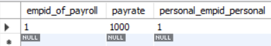

- **one_to_one_personal** table.

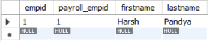

- What if instead of using primary key of another class, can we define another column as foreign key for Personal class? yes, it is possible using `@JoinedColumn`. 
- Using `@JoinedColumn` does not suffice the foreign key, we need to ensure that the column is atleast unique or primary key.
-Lets say we need to establish relationship of OneToOne between Personal and Payroll using `firstname` and `payrate`.

```
package orm.hibernate.annotation.onetoone;

import jakarta.persistence.Entity;
import jakarta.persistence.Id;
import jakarta.persistence.JoinColumn;
import jakarta.persistence.OneToOne;
import jakarta.persistence.Table;

@Entity
@Table(name="one_to_one_personal")
public class Personal {

	@Id
	private int empid_personal;
	
	@Column(unique = true)
	private String firstname;
	
	private String lastname;
	
	@OneToOne
    @JoinColumn(name = "payrate")
	private Payroll payroll;


	public int getEmpid_personal() {
		return empid_personal;
	}

	public void setEmpid_personal(int empid_personal) {
		this.empid_personal = empid_personal;
	}

	public String getFirstname() {
		return firstname;
	}

	public void setFirstname(String firstname) {
		this.firstname = firstname;
	}

	public String getLastname() {
		return lastname;
	}

	public void setLastname(String lastname) {
		this.lastname = lastname;
	}

	public Payroll getPayroll() {
		return payroll;
	}

	public void setPayroll(Payroll payroll) {
		this.payroll = payroll;
	}
	
	
	
}


package orm.hibernate.annotation.onetoone;

import jakarta.persistence.*;

@Entity
@Table(name="one_to_one_payroll")
public class Payroll {

	@Id
	private int empid_of_payroll;
	
	@Column(unique = true)
	private double payrate;
	
	@OneToOne
    @JoinColumn(name = "firstname")
	private Personal personal;


	public double getPayrate() {
		return payrate;
	}

	public void setPayrate(double payrate) {
		this.payrate = payrate;
	}

	public int getEmpid_of_payroll() {
		return empid_of_payroll;
	}

	public void setEmpid_of_payroll(int empid_of_payroll) {
		this.empid_of_payroll = empid_of_payroll;
	}

	public Personal getPersonal() {
		return personal;
	}

	public void setPersonal(Personal personal) {
		this.personal = personal;
	}
	
	
}
```

- Above, using `@JoinedColumn` annotation we specified that for Personal class **payrate** will be the foreign key and for Payroll class **firstname** will be the foreign key.
- Post execution of main method we see the output.

```
package orm.hibernate.annotation;

import java.io.FileInputStream;
import java.io.FileNotFoundException;
import java.io.IOException;
import java.util.Date;

import org.hibernate.Session;
import org.hibernate.SessionFactory;
import org.hibernate.Transaction;
import org.hibernate.cfg.Configuration;

import orm.hibernate.annotation.Address.formStatus;
import orm.hibernate.annotation.onetoone.Payroll;
import orm.hibernate.annotation.onetoone.Personal;

public class MainMethod {
  public static void main(String[] args) {

	  /**
	   * This line creates a new instance of the Configuration class from Hibernate.
	   * The Configuration object is used to configure Hibernate and set up its properties.
	   */
	  Configuration con=new Configuration();
	  
	  /**
	   * This line tells the Configuration object to load the configuration settings from the file
	   *  hibernateConfig.cfg.xml, located in the orm/hibernate directory.
	   * The XML file contains important settings such as database connection details, dialect, 
	   *  mappings, and other Hibernate configurations.
	   */
	  con.configure("orm/hibernate/annotation/hibernateConfig.cfg.xml");
  
	  /**
	   * The SessionFactory is a crucial object in Hibernate. It is a factory for Session objects, 
	   * which are used to interact with the database. The SessionFactory is typically created once 
	   * and used to create multiple Session instances.
	   */
	  SessionFactory ssf=con.buildSessionFactory();
	  
	  /**
	   * Created a session
	   */
	  Session session=ssf.openSession();
	  
	  /**
	   * Using session we created a new transaction
	   */
	  Transaction tx=session.beginTransaction();
	  
	  Personal ps=new Personal();
	  ps.setEmpid_personal(1);
	  ps.setFirstname("Harsh");
	  ps.setLastname("Pandya");
	  
	  Payroll py=new Payroll();
	  py.setEmpid_of_payroll(1);
	  py.setPayrate(1000);
	  ps.setPayroll(py);
	  py.setPersonal(ps);
	  
	  session.save(ps);
	  session.save(py);
	  
	  tx.commit();
	  
	  /**
	   * Close the resources
	   */
	  
	  session.close();
	  
	  
			  
  }
}

Output:
Hibernate: 
    alter table one_to_one_payroll 
       drop 
       foreign key FKa4vhj2nhk4s4io0uvprnlh0ua
Hibernate: 
    alter table one_to_one_personal 
       drop 
       foreign key FK5vkgdf72ixfj4svkwqoxaja11
Hibernate: 
    drop table if exists one_to_one_payroll
Hibernate: 
    drop table if exists one_to_one_personal
Hibernate: 
    create table one_to_one_payroll (
        empid_of_payroll integer not null,
        payrate float(53),
        personal_firstname varchar(255),
        primary key (empid_of_payroll)
    ) engine=InnoDB
Hibernate: 
    create table one_to_one_personal (
        empid_personal integer not null,
        payroll_payrate float(53),
        firstname varchar(255),
        lastname varchar(255),
        primary key (empid_personal)
    ) engine=InnoDB
Hibernate: 
    alter table one_to_one_payroll 
       add constraint UKscp5yw7nhriww1r42i6imos41 unique (payrate)
Hibernate: 
    alter table one_to_one_payroll 
       add constraint UK7oxr11v7qfe4q6gj3ghlowli4 unique (personal_firstname)
Hibernate: 
    alter table one_to_one_personal 
       add constraint UKaek5qliis3iqq491414ahjt82 unique (payroll_payrate)
Hibernate: 
    alter table one_to_one_personal 
       add constraint UKaggj0j00067xuarneudpmswi3 unique (firstname)
Hibernate: 
    alter table one_to_one_payroll 
       add constraint FKa4vhj2nhk4s4io0uvprnlh0ua 
       foreign key (personal_firstname) 
       references one_to_one_personal (firstname)
Hibernate: 
    alter table one_to_one_personal 
       add constraint FK5vkgdf72ixfj4svkwqoxaja11 
       foreign key (payroll_payrate) 
       references one_to_one_payroll (payrate)
Hibernate: 
    select
        null,
        p1_0.payrate,
        p1_0.personal_firstname 
    from
        one_to_one_payroll p1_0 
    where
        p1_0.empid_of_payroll=?
Hibernate: 
    insert 
    into
        one_to_one_personal
        (firstname, lastname, payroll_payrate, empid_personal) 
    values
        (?, ?, ?, ?)
Hibernate: 
    insert 
    into
        one_to_one_payroll
        (payrate, personal_firstname, empid_of_payroll) 
    values
        (?, ?, ?)
Hibernate: 
    update
        one_to_one_personal 
    set
        firstname=?,
        lastname=?,
        payroll_payrate=? 
    where
        empid_personal=?
```

- If we see `payroll_payrate` and `personal_firstname` name columns are created in Personal and Payroll tables resp. Lets verify this.
- Payroll table (**one_to_one_payroll**)

 

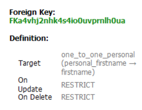

- Personal table (**one_to_one_personal**)

 

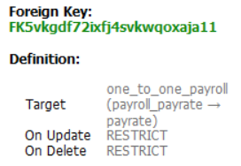 

- Hold on, in the output we can observe that hibernate executes some alter statements before dropping the tables. This is due to those tables may consist of foreign keys.
- Foreign key constraints enforce referential integrity by ensuring that a value in a child table corresponds to a valid entry in a parent table. These constraints create a dependency between the tables involved. When you try to drop a table that is referenced by a foreign key, the database prevents the operation if the constraint is still in place, as this would violate referential integrity.
- Now is it really required to have foreign key column in both personal and child table? it can be avoided because we can find details referring parent table (personal table).
- To avoid creation of foreign key column in child table or in parent table we use `mapped` attribute in `@OneToOne` annotation.
- Lets say in the payroll class we need to avoid column creation
```
package orm.hibernate.annotation.onetoone;

import jakarta.persistence.Column;
import jakarta.persistence.Entity;
import jakarta.persistence.Id;
import jakarta.persistence.JoinColumn;
import jakarta.persistence.OneToOne;
import jakarta.persistence.Table;

@Entity
@Table(name="one_to_one_personal")
public class Personal {

	@Id
	private int empid_personal;
	
	@Column(unique = true)
	private String firstname;
	
	private String lastname;
	
	@OneToOne
    @JoinColumn(name="foreignkey_payroll_payrate",referencedColumnName = "payrate")
	private Payroll personalEmployeesPayroll;


	public int getEmpid_personal() {
		return empid_personal;
	}

	public void setEmpid_personal(int empid_personal) {
		this.empid_personal = empid_personal;
	}

	public String getFirstname() {
		return firstname;
	}

	public void setFirstname(String firstname) {
		this.firstname = firstname;
	}

	public String getLastname() {
		return lastname;
	}

	public void setLastname(String lastname) {
		this.lastname = lastname;
	}

	public Payroll getPersonalEmployeesPayroll() {
		return personalEmployeesPayroll;
	}

	public void setPersonalEmployeesPayroll(Payroll personalEmployeesPayroll) {
		this.personalEmployeesPayroll = personalEmployeesPayroll;
	}

	
	
}

package orm.hibernate.annotation.onetoone;

import jakarta.persistence.*;

@Entity
@Table(name="one_to_one_payroll")
public class Payroll {

	@Id
	private int empid_of_payroll;
	
	@Column(unique = true)
	private double payrate;
	
	@OneToOne(mappedBy = "personalEmployeesPayroll")
	private Personal personal;


	public double getPayrate() {
		return payrate;
	}

	public void setPayrate(double payrate) {
		this.payrate = payrate;
	}

	public int getEmpid_of_payroll() {
		return empid_of_payroll;
	}

	public void setEmpid_of_payroll(int empid_of_payroll) {
		this.empid_of_payroll = empid_of_payroll;
	}

	public Personal getPersonal() {
		return personal;
	}

	public void setPersonal(Personal personal) {
		this.personal = personal;
	}
	
	
}
```

- Here in the Payroll class we have mentioned `mappedBy="personalEmployeesPayroll"`, `mappedBy` in a bidirectional relationship tells Hibernate that
	- "This side of the relationship does not own the foreign key." (Payroll Class)
	- "The relationship is managed by the other side." (Personal Class)

- Post execution of the main method, we can see the output.

```
package orm.hibernate.annotation;

import java.io.FileInputStream;
import java.io.FileNotFoundException;
import java.io.IOException;
import java.util.Date;

import org.hibernate.Session;
import org.hibernate.SessionFactory;
import org.hibernate.Transaction;
import org.hibernate.cfg.Configuration;

import orm.hibernate.annotation.Address.formStatus;
import orm.hibernate.annotation.onetoone.Payroll;
import orm.hibernate.annotation.onetoone.Personal;

public class MainMethod {
  public static void main(String[] args) {

	  /**
	   * This line creates a new instance of the Configuration class from Hibernate.
	   * The Configuration object is used to configure Hibernate and set up its properties.
	   */
	  Configuration con=new Configuration();
	  
	  /**
	   * This line tells the Configuration object to load the configuration settings from the file
	   *  hibernateConfig.cfg.xml, located in the orm/hibernate directory.
	   * The XML file contains important settings such as database connection details, dialect, 
	   *  mappings, and other Hibernate configurations.
	   */
	  con.configure("orm/hibernate/annotation/hibernateConfig.cfg.xml");
  
	  /**
	   * The SessionFactory is a crucial object in Hibernate. It is a factory for Session objects, 
	   * which are used to interact with the database. The SessionFactory is typically created once 
	   * and used to create multiple Session instances.
	   */
	  SessionFactory ssf=con.buildSessionFactory();
	  
	  /**
	   * Created a session
	   */
	  Session session=ssf.openSession();
	  
	  /**
	   * Using session we created a new transaction
	   */
	  Transaction tx=session.beginTransaction();
	  
	  Personal ps=new Personal();
	  ps.setEmpid_personal(1);
	  ps.setFirstname("Harsh");
	  ps.setLastname("Pandya");
	  
	  Payroll py=new Payroll();
	  py.setEmpid_of_payroll(1);
	  py.setPayrate(1000);
	  ps.setPersonalEmployeesPayroll(py);
	  py.setPersonal(ps);
	  
	  session.save(ps);
	  session.save(py);
	  
	  tx.commit();
	  
	  /**
	   * Close the resources
	   */
	  
	  session.close();
	  
	  
			  
  }
}

Output:
Hibernate: 
    alter table one_to_one_personal 
       drop 
       foreign key FKr3jk4vpskrfvkmnrg6rod3fg9
Hibernate: 
    drop table if exists one_to_one_payroll
Hibernate: 
    drop table if exists one_to_one_personal
Hibernate: 
    create table one_to_one_payroll (
        empid_of_payroll integer not null,
        payrate float(53),
        primary key (empid_of_payroll)
    ) engine=InnoDB
Hibernate: 
    create table one_to_one_personal (
        empid_personal integer not null,
        foreignkey_payroll_payrate float(53),
        firstname varchar(255),
        lastname varchar(255),
        primary key (empid_personal)
    ) engine=InnoDB
Hibernate: 
    alter table one_to_one_payroll 
       add constraint UKscp5yw7nhriww1r42i6imos41 unique (payrate)
Hibernate: 
    alter table one_to_one_personal 
       add constraint UKninpu581cmnqtj9s35mlarrn7 unique (foreignkey_payroll_payrate)
Hibernate: 
    alter table one_to_one_personal 
       add constraint UKaggj0j00067xuarneudpmswi3 unique (firstname)
Hibernate: 
    alter table one_to_one_personal 
       add constraint FKr3jk4vpskrfvkmnrg6rod3fg9 
       foreign key (foreignkey_payroll_payrate) 
       references one_to_one_payroll (payrate)
Hibernate: 
    select
        null,
        p1_0.payrate 
    from
        one_to_one_payroll p1_0 
    where
        p1_0.empid_of_payroll=?
Hibernate: 
    insert 
    into
        one_to_one_personal
        (firstname, lastname, foreignkey_payroll_payrate, empid_personal) 
    values
        (?, ?, ?, ?)
Hibernate: 
    insert 
    into
        one_to_one_payroll
        (payrate, empid_of_payroll) 
    values
        (?, ?)
Hibernate: 
    update
        one_to_one_personal 
    set
        firstname=?,
        lastname=?,
        foreignkey_payroll_payrate=? 
    where
        empid_personal=?
```

- Here we have used `name` attribute which tells hibernate to store the foreign key values under a column name `foreignkey_payroll_payrate`.

- Payroll table

 

- Personal table

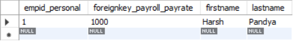

#### One-to-Many and Many-to-One
- A one-to-many (1:N) relationship means a record in Table A can relate to zero, one, or many records in Table B. Many records in Table B can relate to one record in Table A. 

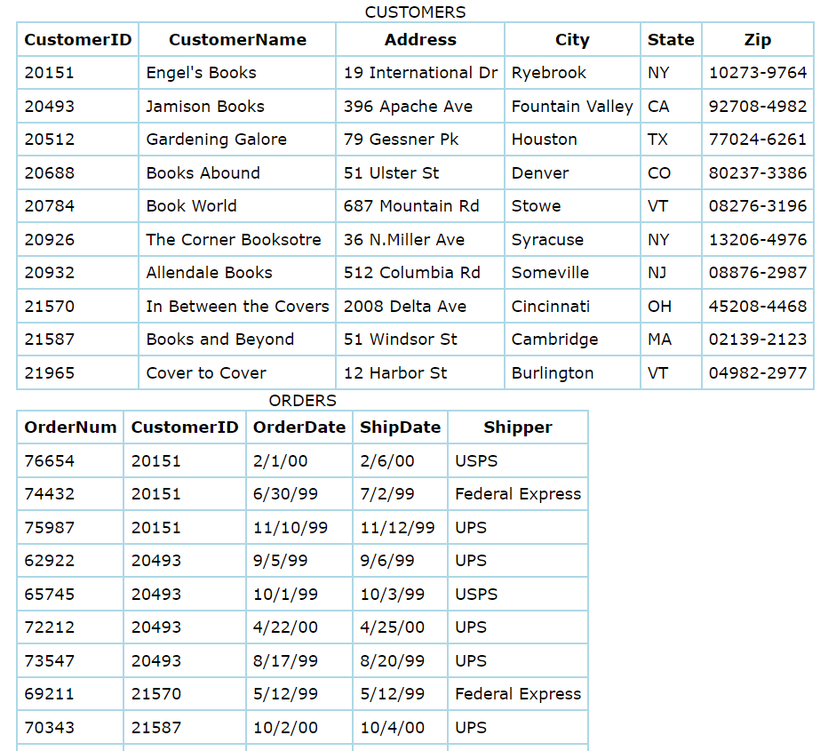

- So here in this mapping, one record of a table A can have relation between 0, 1 or N records of table B. Multiple, 1 or 0 records of table B will have relationship with 1 record of table A (Many-to-One)
- So in java we need to store in a collections like a list. So lets say we have two class Customer and Order class.

```
package orm.hibernate.annotation.onetomany;

import java.util.List;

import jakarta.persistence.*;

@Entity
@Table(name="one_to_many_customer")
public class Customer {

	@Id
	private int custId;
	
	private String custName;
	
	private String custCity;
	
	/**
	 * Extra column will not be created in Customer class
	 */
	@OneToMany(mappedBy = "customerIdhavingMultipleOrders")
	private List<CustomerOrder> allOrdersofACustomer;

	public int getCustId() {
		return custId;
	}

	public void setCustId(int custId) {
		this.custId = custId;
	}

	public String getCustName() {
		return custName;
	}

	public void setCustName(String custName) {
		this.custName = custName;
	}

	public String getCustCity() {
		return custCity;
	}

	public void setCustCity(String custCity) {
		this.custCity = custCity;
	}

	public List<CustomerOrder> getAllOrdersofACustomer() {
		return allOrdersofACustomer;
	}

	public void setAllOrdersofACustomer(List<CustomerOrder> allOrdersofACustomer) {
		this.allOrdersofACustomer = allOrdersofACustomer;
	}


	
}


package orm.hibernate.annotation.onetomany;

import jakarta.persistence.*;
import orm.hibernate.annotation.onetomany.Customer;

@Entity
@Table(name="many_to_one_customerorder")
public class CustomerOrder {

	@Id
	private int unqiueOrderCode;
	
	private String orderNumber;
	
	@ManyToOne
	@JoinColumn(name="foreignkey_cust_id", referencedColumnName = "custId")
	private Customer customerIdhavingMultipleOrders ;

	public int getUnqiueOrderCode() {
		return unqiueOrderCode;
	}

	public void setUnqiueOrderCode(int unqiueOrderCode) {
		this.unqiueOrderCode = unqiueOrderCode;
	}

	public String getOrderNumber() {
		return orderNumber;
	}

	public void setOrderNumber(String orderNumber) {
		this.orderNumber = orderNumber;
	}

	public Customer getCustomerIdhavingMultipleOrders() {
		return customerIdhavingMultipleOrders;
	}

	public void setCustomerIdhavingMultipleOrders(Customer customerIdhavingMultipleOrders) {
		this.customerIdhavingMultipleOrders = customerIdhavingMultipleOrders;
	}

	
	
}
```

- Below is the cfg xml file details.

```
<?xml version="1.0" encoding="UTF-8"?>
<!DOCTYPE hibernate-configuration SYSTEM 
"http://www.hibernate.org/dtd/hibernate-configuration-3.0.dtd">
<!-- Version 8 MySQL hiberante-cfg.xml example for Hibernate 5 -->
<hibernate-configuration>
  <session-factory>
  <!-- Driver name -->
    <property name="connection.driver_class">com.mysql.cj.jdbc.Driver</property>
    <!-- property name="connection.driver_class">com.mysql.jdbc.Driver</property -->
    <property name="connection.url">jdbc:mysql://localhost:3306/myhibernatedb</property>
    <!-- 
    a "dialect" is a configuration setting that specifies the type of database you are using. 
    It tells Hibernate how to generate the appropriate SQL statements for your particular database system,
     as different databases have different SQL syntax, data types, and functions.
     -->
    <property name="dialect">org.hibernate.dialect.MySQLDialect</property>
    <property name="connection.username">root</property>
    <property name="connection.password">Meetpandya40@</property>
<!--     <property name="connection.pool_size">3</property>
 -->    <!--property name="dialect">org.hibernate.dialect.MySQLDialect</property-->
<!--     <property name="current_session_context_class">thread</property>
 -->    
 	<!-- 
 	show sql =  true states that whatever hibernate fires the query it will show in the console.
 	 -->
    <property name="show_sql">true</property>
    <property name="format_sql">true</property>
    
    <!-- 
    When we use create , it will create table , but if existing tables are there those will get deleted
    and again will get created. So it is better to use update over create. It will create only once if
    table does not exists.
     -->
    <property name="hbm2ddl.auto">create</property>
    <!-- mapping class="com.mcnz.jpa.examples.Player" / -->
<!--     <mapping class="orm.hibernate.annotation.Student"/>
    <mapping class="orm.hibernate.annotation.Address"/>
    <mapping class="orm.hibernate.annotation.Employee"/>
    <mapping class="orm.hibernate.annotation.onetoone.Personal" />
    <mapping class="orm.hibernate.annotation.onetoone.Payroll" />  -->
    <mapping class="orm.hibernate.annotation.onetomany.Customer" />
    <mapping class="orm.hibernate.annotation.onetomany.CustomerOrder" />
    
  </session-factory>
</hibernate-configuration>
```

- Post execution of main method, we can see output

```
Hibernate: 
    create table many_to_one_customerorder (
        foreignkey_cust_id integer,
        unqiueOrderCode integer not null,
        orderNumber varchar(255),
        primary key (unqiueOrderCode)
    ) engine=InnoDB
Hibernate: 
    create table one_to_many_customer (
        custId integer not null,
        custCity varchar(255),
        custName varchar(255),
        primary key (custId)
    ) engine=InnoDB
Hibernate: 
    alter table many_to_one_customerorder 
       add constraint FKqfymbg6461b6mufmeeigkkjfw 
       foreign key (foreignkey_cust_id) 
       references one_to_many_customer (custId)
Hibernate: 
    insert 
    into
        one_to_many_customer
        (custCity, custName, custId) 
    values
        (?, ?, ?)
Hibernate: 
    insert 
    into
        many_to_one_customerorder
        (foreignkey_cust_id, orderNumber, unqiueOrderCode) 
    values
        (?, ?, ?)
Hibernate: 
    insert 
    into
        many_to_one_customerorder
        (foreignkey_cust_id, orderNumber, unqiueOrderCode) 
    values
        (?, ?, ?)
```

- Here, our foreign key is Customer ID for Customer Order class. This key's values are stored in Customer Order class.

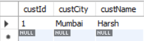 

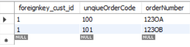 

 

#### Many-To-Many
- In a relational database, a many-to-many relationship between two tables is not supported directly. Instead, it is handled by creating a junction (or join) table that stores foreign keys referencing the primary keys of the two related tables.
- In a many-to-many relationship, each record in Table A can be related to multiple records in Table B, and each record in Table B can be related to multiple records in Table A. To manage this relationship in an RDBMS, a junction table is used.

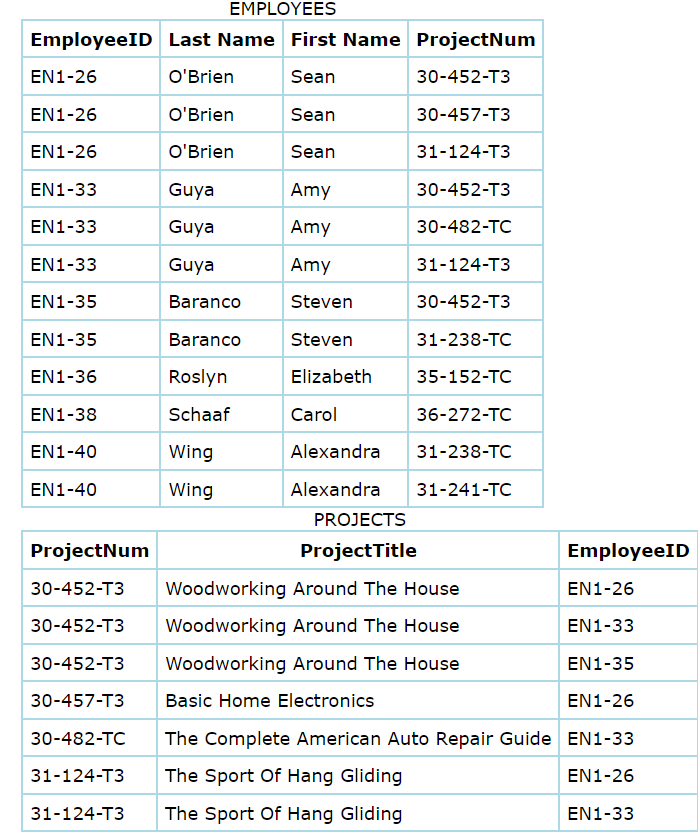 

 

- An intersection table and two one-to-many relationships
- This forms two one-to-many relationships; each employee can work on many projects and many employees can work on a single project.
- In hibernate, to achieve this we have `@ManyToMany`. Lets say we have two classes EmployeeProjects and Projects+.

```
package orm.hibernate.annotation.manytomany;

import java.util.List;

import jakarta.persistence.*;

@Entity
@Table(name = "many_to_many_employeeprojects")
public class EmployeeProjects {

	@Id
	private int empId;
	
	private String empName;
	
	@ManyToMany
	private List<Projects> empWorkingonProjects;

	public int getEmpId() {
		return empId;
	}

	public void setEmpId(int empId) {
		this.empId = empId;
	}

	public String getEmpName() {
		return empName;
	}

	public void setEmpName(String empName) {
		this.empName = empName;
	}

	public List<Projects> getEmpWorkingonProjects() {
		return empWorkingonProjects;
	}

	public void setEmpWorkingonProjects(List<Projects> empWorkingonProjects) {
		this.empWorkingonProjects = empWorkingonProjects;
	}
	
	
}


package orm.hibernate.annotation.manytomany;

import java.util.List;

import jakarta.persistence.*;

@Entity
@Table(name = "many_to_many_projects")
public class Projects {

	@Id
	private int projectId;
	
	private String projectName;
	
	@ManyToMany
	private List<EmployeeProjects> projectAssignToemp;

	public int getProjectId() {
		return projectId;
	}

	public void setProjectId(int projectId) {
		this.projectId = projectId;
	}

	public String getProjectName() {
		return projectName;
	}

	public void setProjectName(String projectName) {
		this.projectName = projectName;
	}

	public List<EmployeeProjects> getProjectAssignToemp() {
		return projectAssignToemp;
	}

	public void setProjectAssignToemp(List<EmployeeProjects> projectAssignToemp) {
		this.projectAssignToemp = projectAssignToemp;
	}
	
	
	
}
```

- Below is the hibernate cfg xml file.

```
<?xml version="1.0" encoding="UTF-8"?>
<!DOCTYPE hibernate-configuration SYSTEM 
"http://www.hibernate.org/dtd/hibernate-configuration-3.0.dtd">
<!-- Version 8 MySQL hiberante-cfg.xml example for Hibernate 5 -->
<hibernate-configuration>
  <session-factory>
  <!-- Driver name -->
    <property name="connection.driver_class">com.mysql.cj.jdbc.Driver</property>
    <!-- property name="connection.driver_class">com.mysql.jdbc.Driver</property -->
    <property name="connection.url">jdbc:mysql://localhost:3306/myhibernatedb</property>
    <!-- 
    a "dialect" is a configuration setting that specifies the type of database you are using. 
    It tells Hibernate how to generate the appropriate SQL statements for your particular database system,
     as different databases have different SQL syntax, data types, and functions.
     -->
    <property name="dialect">org.hibernate.dialect.MySQLDialect</property>
    <property name="connection.username">root</property>
    <property name="connection.password">Meetpandya40@</property>
<!--     <property name="connection.pool_size">3</property>
 -->    <!--property name="dialect">org.hibernate.dialect.MySQLDialect</property-->
<!--     <property name="current_session_context_class">thread</property>
 -->    
 	<!-- 
 	show sql =  true states that whatever hibernate fires the query it will show in the console.
 	 -->
    <property name="show_sql">true</property>
    <property name="format_sql">true</property>
    
    <!-- 
    When we use create , it will create table , but if existing tables are there those will get deleted
    and again will get created. So it is better to use update over create. It will create only once if
    table does not exists.
     -->
    <property name="hbm2ddl.auto">create</property>
    <!-- mapping class="com.mcnz.jpa.examples.Player" / -->
<!--     <mapping class="orm.hibernate.annotation.Student"/>
    <mapping class="orm.hibernate.annotation.Address"/>
    <mapping class="orm.hibernate.annotation.Employee"/>
    <mapping class="orm.hibernate.annotation.onetoone.Personal" />
    <mapping class="orm.hibernate.annotation.onetoone.Payroll" /> 
    <mapping class="orm.hibernate.annotation.onetomany.Customer" />
    <mapping class="orm.hibernate.annotation.onetomany.CustomerOrder" /> -->
    <mapping class="orm.hibernate.annotation.manytomany.EmployeeProjects" />
    <mapping class="orm.hibernate.annotation.manytomany.Projects" />    
  </session-factory>
</hibernate-configuration>
```

- Below is the main method, can you guess how much tables will be created?

```
package orm.hibernate.annotation;

import java.io.FileInputStream;
import java.io.FileNotFoundException;
import java.io.IOException;
import java.util.ArrayList;
import java.util.Arrays;
import java.util.Date;
import java.util.List;

import org.hibernate.Session;
import org.hibernate.SessionFactory;
import org.hibernate.Transaction;
import org.hibernate.cfg.Configuration;

import orm.hibernate.annotation.Address.formStatus;
import orm.hibernate.annotation.manytomany.EmployeeProjects;
import orm.hibernate.annotation.manytomany.Projects;
import orm.hibernate.annotation.onetomany.Customer;
import orm.hibernate.annotation.onetomany.CustomerOrder;
import orm.hibernate.annotation.onetoone.Payroll;
import orm.hibernate.annotation.onetoone.Personal;

public class MainMethod {
  public static void main(String[] args) {

	  /**
	   * This line creates a new instance of the Configuration class from Hibernate.
	   * The Configuration object is used to configure Hibernate and set up its properties.
	   */
	  Configuration con=new Configuration();
	  
	  /**
	   * This line tells the Configuration object to load the configuration settings from the file
	   *  hibernateConfig.cfg.xml, located in the orm/hibernate directory.
	   * The XML file contains important settings such as database connection details, dialect, 
	   *  mappings, and other Hibernate configurations.
	   */
	  con.configure("orm/hibernate/annotation/hibernateConfig.cfg.xml");
  
	  /**
	   * The SessionFactory is a crucial object in Hibernate. It is a factory for Session objects, 
	   * which are used to interact with the database. The SessionFactory is typically created once 
	   * and used to create multiple Session instances.
	   */
	  SessionFactory ssf=con.buildSessionFactory();
	  
	  /**
	   * Created a session
	   */
	  Session session=ssf.openSession();
	  
	  /**
	   * Using session we created a new transaction
	   */
	  Transaction tx=session.beginTransaction();
	  
	  EmployeeProjects empProject1=new EmployeeProjects();
	  empProject1.setEmpId(1);
	  empProject1.setEmpName("Harsh");
	  EmployeeProjects empProject2=new EmployeeProjects();
	  empProject2.setEmpId(2);
	  empProject2.setEmpName("Meet");	
	  
	  Projects proj1=new Projects();
	  proj1.setProjectId(404);
	  proj1.setProjectName("AI");
	  Projects proj2=new Projects();
	  proj2.setProjectId(405);
	  proj2.setProjectName("Hibernate");
	  
	  empProject1.setEmpWorkingonProjects(Arrays.asList(proj1,proj2));
	  empProject2.setEmpWorkingonProjects(Arrays.asList(proj1));
	  
	  proj1.setProjectAssignToemp(Arrays.asList(empProject1,empProject2));
	  proj2.setProjectAssignToemp(Arrays.asList(empProject2));
	  
	  session.save(empProject1);
	  session.save(empProject2);
	  session.save(proj1);
	  session.save(proj2);
	  
	  
	  
	  tx.commit();
	  
	  /**
	   * Close the resources
	   */
	  
	  session.close();
	  
	  
			  
  }
}


Output:
Hibernate: 
    create table many_to_many_employeeprojects (
        empId integer not null,
        empName varchar(255),
        primary key (empId)
    ) engine=InnoDB
Hibernate: 
    create table many_to_many_employeeprojects_many_to_many_projects (
        EmployeeProjects_empId integer not null,
        empWorkingonProjects_projectId integer not null
    ) engine=InnoDB
Hibernate: 
    create table many_to_many_projects (
        projectId integer not null,
        projectName varchar(255),
        primary key (projectId)
    ) engine=InnoDB
Hibernate: 
    create table many_to_many_projects_many_to_many_employeeprojects (
        Projects_projectId integer not null,
        projectAssignToemp_empId integer not null
    ) engine=InnoDB
Hibernate: 
    alter table many_to_many_employeeprojects_many_to_many_projects 
       add constraint FK1ndi0cjgtt5t4nydn303awyb7 
       foreign key (empWorkingonProjects_projectId) 
       references many_to_many_projects (projectId)
Hibernate: 
    alter table many_to_many_employeeprojects_many_to_many_projects 
       add constraint FKgpb1ds9rwalup691ohr8vwgn3 
       foreign key (EmployeeProjects_empId) 
       references many_to_many_employeeprojects (empId)
Hibernate: 
    alter table many_to_many_projects_many_to_many_employeeprojects 
       add constraint FKnq1r6qf93rurnsxnrlh3qoqew 
       foreign key (projectAssignToemp_empId) 
       references many_to_many_employeeprojects (empId)
Hibernate: 
    alter table many_to_many_projects_many_to_many_employeeprojects 
       add constraint FKdr9wdftbx64ktpp95ycqu5r6e 
       foreign key (Projects_projectId) 
       references many_to_many_projects (projectId)
Hibernate: 
    insert 
    into
        many_to_many_employeeprojects
        (empName, empId) 
    values
        (?, ?)
Hibernate: 
    insert 
    into
        many_to_many_employeeprojects
        (empName, empId) 
    values
        (?, ?)
Hibernate: 
    insert 
    into
        many_to_many_projects
        (projectName, projectId) 
    values
        (?, ?)
Hibernate: 
    insert 
    into
        many_to_many_projects
        (projectName, projectId) 
    values
        (?, ?)
Hibernate: 
    insert 
    into
        many_to_many_employeeprojects_many_to_many_projects
        (EmployeeProjects_empId, empWorkingonProjects_projectId) 
    values
        (?, ?)
Hibernate: 
    insert 
    into
        many_to_many_employeeprojects_many_to_many_projects
        (EmployeeProjects_empId, empWorkingonProjects_projectId) 
    values
        (?, ?)
Hibernate: 
    insert 
    into
        many_to_many_employeeprojects_many_to_many_projects
        (EmployeeProjects_empId, empWorkingonProjects_projectId) 
    values
        (?, ?)
Hibernate: 
    insert 
    into
        many_to_many_projects_many_to_many_employeeprojects
        (Projects_projectId, projectAssignToemp_empId) 
    values
        (?, ?)
Hibernate: 
    insert 
    into
        many_to_many_projects_many_to_many_employeeprojects
        (Projects_projectId, projectAssignToemp_empId) 
    values
        (?, ?)
Hibernate: 
    insert 
    into
        many_to_many_projects_many_to_many_employeeprojects
        (Projects_projectId, projectAssignToemp_empId) 
    values
        (?, ?)
```

- We can see there are **4** tables created. 
	1. many_to_many_employeeprojects
	2. many_to_many_projects
	3. many_to_many_employeeprojects_many_to_many_projects
	4. many_to_many_projects_many_to_many_employeeprojects

- Why so? because we have told mentioned `@ManyToMany` annotation for both the classes. So wrto **many_to_many_employeeprojects** table the juntion or join table using **many_to_many_projects** is **many_to_many_employeeprojects_many_to_many_projects** and wrto **many_to_many_projects** table the join table using **many_to_many_employeeprojects** is **many_to_many_projects_many_to_many_employeeprojects**. 
- Whenever hibernates creates a table it follows a format **tableName1_tableName2**.
- Below are the data details for all 4 of the tables.
- Table: many_to_many_employeeprojects


- Table: many_to_many_projects

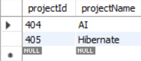 

- Table: many_to_many_employeeprojects_many_to_many_projects, it consist of two foreign keys.

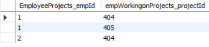 

- Table: many_to_many_projects_many_to_many_employeeprojects, it also consist of two foreign keys.


- Lets normalize the DB by removing **many_to_many_projects_many_to_many_employeeprojects** table. Table **many_to_many_employeeprojects_many_to_many_projects** can be used for references for all sort of relations.
- Also lets give the join table and its columns a custom name.

```
package orm.hibernate.annotation.manytomany;

import java.util.List;

import jakarta.persistence.*;

@Entity
@Table(name = "many_to_many_employeeprojects")
public class EmployeeProjects {

	@Id
	private int empId;
	
	private String empName;
	
	@ManyToMany
	@JoinTable(
			name ="joined_table_employee_project",
			joinColumns= { @JoinColumn( name="employee_ids") }, //EmployeeProject -> empid
			inverseJoinColumns = { @JoinColumn( name="project_ids") } //Projects -> projectId 
			)
	private List<Projects> empWorkingonProjects;

	public int getEmpId() {
		return empId;
	}

	public void setEmpId(int empId) {
		this.empId = empId;
	}

	public String getEmpName() {
		return empName;
	}

	public void setEmpName(String empName) {
		this.empName = empName;
	}

	public List<Projects> getEmpWorkingonProjects() {
		return empWorkingonProjects;
	}

	public void setEmpWorkingonProjects(List<Projects> empWorkingonProjects) {
		this.empWorkingonProjects = empWorkingonProjects;
	}
	
	
}


package orm.hibernate.annotation.manytomany;

import java.util.List;

import jakarta.persistence.*;

@Entity
@Table(name = "many_to_many_projects")
public class Projects {

	@Id
	private int projectId;
	
	private String projectName;
	
	@ManyToMany(mappedBy = "empWorkingonProjects")
	private List<EmployeeProjects> projectAssignToemp;

	public int getProjectId() {
		return projectId;
	}

	public void setProjectId(int projectId) {
		this.projectId = projectId;
	}

	public String getProjectName() {
		return projectName;
	}

	public void setProjectName(String projectName) {
		this.projectName = projectName;
	}

	public List<EmployeeProjects> getProjectAssignToemp() {
		return projectAssignToemp;
	}

	public void setProjectAssignToemp(List<EmployeeProjects> projectAssignToemp) {
		this.projectAssignToemp = projectAssignToemp;
	}
	
	
	
}
```

- Post execution of main method, we have now 3 tables.

```
Code remains the same of main method

Output:
Hibernate: 
    create table joined_table_employee_project (
        employee_ids integer not null,
        project_ids integer not null
    ) engine=InnoDB
Hibernate: 
    create table many_to_many_employeeprojects (
        empId integer not null,
        empName varchar(255),
        primary key (empId)
    ) engine=InnoDB
Hibernate: 
    create table many_to_many_projects (
        projectId integer not null,
        projectName varchar(255),
        primary key (projectId)
    ) engine=InnoDB
Hibernate: 
    alter table joined_table_employee_project 
       add constraint FK6eh8fs0x3k573cjlfeud8xyu2 
       foreign key (project_ids) 
       references many_to_many_projects (projectId)
Hibernate: 
    alter table joined_table_employee_project 
       add constraint FKj5d897hd34d4tx0j8kvwks7yd 
       foreign key (employee_ids) 
       references many_to_many_employeeprojects (empId)
Hibernate: 
    insert 
    into
        many_to_many_employeeprojects
        (empName, empId) 
    values
        (?, ?)
Hibernate: 
    insert 
    into
        many_to_many_employeeprojects
        (empName, empId) 
    values
        (?, ?)
Hibernate: 
    insert 
    into
        many_to_many_projects
        (projectName, projectId) 
    values
        (?, ?)
Hibernate: 
    insert 
    into
        many_to_many_projects
        (projectName, projectId) 
    values
        (?, ?)
Hibernate: 
    insert 
    into
        joined_table_employee_project
        (employee_ids, project_ids) 
    values
        (?, ?)
Hibernate: 
    insert 
    into
        joined_table_employee_project
        (employee_ids, project_ids) 
    values
        (?, ?)
Hibernate: 
    insert 
    into
        joined_table_employee_project
        (employee_ids, project_ids) 
    values
        (?, ?)
```

- Output of **joined_table_employee_project**

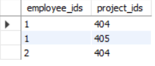 

- If we observer all the relationship between entities, we need to explicity save child entities along with parent entity to store the data. At this point since the data is less , we could repeat save operation for all the child entities.
- What if we have large number of entities? do we need to write repeatedly? No, we have a cascade option in hibernate.
- Lets say we consider the same example for OneToMany relationship between Customer and CustomerOrder class. Lets say we need to save 3 CustomerOrders for a customer using cascade. 
- To do that first we need to tell hibernate that my parent class will use cascade.

```
package orm.hibernate.annotation.onetomany;

import java.util.List;

import jakarta.persistence.*;

@Entity
@Table(name="one_to_many_customer")
public class Customer {

	@Id
	private int custId;
	
	private String custName;
	
	private String custCity;
	
	/**
	 * Extra column will not be created in Customer class
	 */
	@OneToMany(mappedBy = "customerIdhavingMultipleOrders",fetch = FetchType.EAGER,cascade = CascadeType.ALL)
	private List<CustomerOrder> allOrdersofACustomer;

	public int getCustId() {
		return custId;
	}

	public void setCustId(int custId) {
		this.custId = custId;
	}

	public String getCustName() {
		return custName;
	}

	public void setCustName(String custName) {
		this.custName = custName;
	}

	public String getCustCity() {
		return custCity;
	}

	public void setCustCity(String custCity) {
		this.custCity = custCity;
	}

	public List<CustomerOrder> getAllOrdersofACustomer() {
		return allOrdersofACustomer;
	}

	public void setAllOrdersofACustomer(List<CustomerOrder> allOrdersofACustomer) {
		this.allOrdersofACustomer = allOrdersofACustomer;
	}


	
}
```
- Lets create some entities and execute main method.

```
package orm.hibernate.annotation;

import java.io.FileInputStream;
import java.io.FileNotFoundException;
import java.io.IOException;
import java.util.ArrayList;
import java.util.Arrays;
import java.util.Date;
import java.util.List;

import org.hibernate.Session;
import org.hibernate.SessionFactory;
import org.hibernate.Transaction;
import org.hibernate.cfg.Configuration;

import orm.hibernate.annotation.Address.formStatus;
import orm.hibernate.annotation.manytomany.EmployeeProjects;
import orm.hibernate.annotation.manytomany.Projects;
import orm.hibernate.annotation.onetomany.Customer;
import orm.hibernate.annotation.onetomany.CustomerOrder;
import orm.hibernate.annotation.onetoone.Payroll;
import orm.hibernate.annotation.onetoone.Personal;

public class MainMethod {
  public static void main(String[] args) {

	  /**
	   * This line creates a new instance of the Configuration class from Hibernate.
	   * The Configuration object is used to configure Hibernate and set up its properties.
	   */
	  Configuration con=new Configuration();
	  
	  /**
	   * This line tells the Configuration object to load the configuration settings from the file
	   *  hibernateConfig.cfg.xml, located in the orm/hibernate directory.
	   * The XML file contains important settings such as database connection details, dialect, 
	   *  mappings, and other Hibernate configurations.
	   */
	  con.configure("orm/hibernate/hibernateConfig.cfg.xml");
  
	  /**
	   * The SessionFactory is a crucial object in Hibernate. It is a factory for Session objects, 
	   * which are used to interact with the database. The SessionFactory is typically created once 
	   * and used to create multiple Session instances.
	   */
	  SessionFactory ssf=con.buildSessionFactory();
	  
	  /**
	   * Created a session
	   */
	  Session session=ssf.openSession();
	  
	  /**
	   * Using session we created a new transaction
	   */
	  Transaction tx=session.beginTransaction();
	  	  
	  /**
	   * Cascading
	   */
	  List<CustomerOrder> allOrders=new ArrayList<>();
	  Customer cust1=new Customer();
	  cust1.setCustId(2);
	  cust1.setCustName("Meet");
	  cust1.setCustCity("Mumbai");
	  
	  CustomerOrder custOrder3=new CustomerOrder();
	  custOrder3.setUnqiueOrderCode(102);
	  custOrder3.setOrderNumber("123OC");
	  custOrder3.setCustomerIdhavingMultipleOrders(cust1);
	  CustomerOrder custOrder4=new CustomerOrder();
	  custOrder4.setUnqiueOrderCode(103);
	  custOrder4.setOrderNumber("123OD");
	  custOrder4.setCustomerIdhavingMultipleOrders(cust1);
	  CustomerOrder custOrder5=new CustomerOrder();
	  custOrder5.setUnqiueOrderCode(104);
	  custOrder5.setOrderNumber("123OE");
	  custOrder5.setCustomerIdhavingMultipleOrders(cust1);

	  allOrders.add(custOrder3);
	  allOrders.add(custOrder4);
	  allOrders.add(custOrder5);
	  cust1.setAllOrdersofACustomer(allOrders);
	  session.save(cust1);
	  /**
	   * automatically saves the child entities for CustomerOrder
	   */
	  
	  tx.commit();  
	  
	  
	  /**
	   * Close the resources
	   */
	  
	  session.close();
	  
	  
			  
  }
}

Output:
Hibernate: 
    insert 
    into
        one_to_many_customer
        (custCity, custName, custId) 
    values
        (?, ?, ?)
Hibernate: 
    insert 
    into
        many_to_one_customerorder
        (foreignkey_cust_id, orderNumber, unqiueOrderCode) 
    values
        (?, ?, ?)
Hibernate: 
    insert 
    into
        many_to_one_customerorder
        (foreignkey_cust_id, orderNumber, unqiueOrderCode) 
    values
        (?, ?, ?)
Hibernate: 
    insert 
    into
        many_to_one_customerorder
        (foreignkey_cust_id, orderNumber, unqiueOrderCode) 
    values
        (?, ?, ?)
```

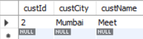 


- If we observe the output, our parent entity got inserted once and cascade parameter automatically inserted all its child entities.
- Cascading in Hibernate is a feature that automatically applies certain operations from a parent entity to its related child entities. It refers to the automatic persistence of related entities.
- There are types of Cascading
	- CascadeType.PERSIST: When the parent entity is saved, the child entities are also saved.
	- CascadeType.MERGE: When the parent entity is merged, the child entities are also merged.
	- CascadeType.REMOVE: When the parent entity is deleted, the child entities are also deleted.
	- CascadeType.REFRESH: When the parent entity is refreshed, the child entities are also refreshed.
	- CascadeType.DETACH: When the parent entity is detached from the session, the child entities are also detached.
	- CascadeType.ALL: Applies all the above types of cascading.
- Cascading is not applicable to standalone entities without relationships. It only makes sense in the context of relationships where one entity's lifecycle is closely tied to another's.

### Fetching Collections of Entities

- We have seen for retrieving values we have **get** and **load**.
- These methods control the retrieval of a specific entity by its identifier. The choice between them depends on whether you need immediate access (get) or can defer loading (load).
- These methods provides us values from the database or session.
- What if we kept those values whenever the entity is loaded? or when we call it? **Eager** and **Lazy** strategies determine how and when associated data (related entities or collections) is fetched.
- Using the both strategy and get or load method work together to provide flexible and efficient data access patterns in Hibernate.
- Eager and lazy loading strategies are indeed primarily used in the context of relational mappings in Hibernate, particularly for associations like  `@OneToOne`, `@OneToMany`, `@ManyToOne` and `@ManyToMany`.

- **LAZY**
	- This is the default FetchType in Hibernate. It means that the associated entity will be fetched only when it is accessed for the first time. This can improve performance in cases where the associated entity is not required most of the time.
	- It can be useful if the entity has a lot of data and is not needed for every use of the parent entity.

- **EAGER**
	- This FetchType means that the associated entity will be fetched together with the main entity when the main entity is fetched from the database. This can be useful in cases where the associated entity is always required, but can also result in a performance decrease if the associated entity is large and/or has many associations itself.
	- The FetchType.EAGER option indicates that the associated entity should be fetched eagerly, which means that it will be fetched at the same time as the parent entity.
	- Using FetchType.EAGER can be more efficient than using FetchType.LAZY if the associated entity is needed for most uses of the parent entity, as it avoids the need for additional database queries to fetch the associated entity when it is accessed. However, it can also be less efficient if the associated entity has a lot of data and is not needed for every use of the parent entity, as it will always be fetched along with the parent entity.
- Depending on the application fetching strategy can be opted.
- Lets see an example of lazy type. In the `@OneToOne` we had defined two classes Personal and Payroll.
- So here lets us define Lazy loading for Payroll class.

```
package orm.hibernate.annotation.onetoone;

import jakarta.persistence.Column;
import jakarta.persistence.Entity;
import jakarta.persistence.FetchType;
import jakarta.persistence.Id;
import jakarta.persistence.JoinColumn;
import jakarta.persistence.OneToOne;
import jakarta.persistence.Table;

@Entity
@Table(name="one_to_one_personal")
public class Personal {

	@Id
	private int empid_personal;
	
	@Column(unique = true)
	private String firstname;
	
	private String lastname;
	
	/**
	 * Default fetching type is lazy
	 */
	@OneToOne(fetch = FetchType.LAZY)
    @JoinColumn(name="foreignkey_payroll_payrate",referencedColumnName = "payrate")
	private Payroll personalEmployeesPayroll;


	public int getEmpid_personal() {
		return empid_personal;
	}

	public void setEmpid_personal(int empid_personal) {
		this.empid_personal = empid_personal;
	}

	public String getFirstname() {
		return firstname;
	}

	public void setFirstname(String firstname) {
		this.firstname = firstname;
	}

	public String getLastname() {
		return lastname;
	}

	public void setLastname(String lastname) {
		this.lastname = lastname;
	}

	public Payroll getPersonalEmployeesPayroll() {
		return personalEmployeesPayroll;
	}

	public void setPersonalEmployeesPayroll(Payroll personalEmployeesPayroll) {
		this.personalEmployeesPayroll = personalEmployeesPayroll;
	}

	
	
}

package orm.hibernate.annotation.onetoone;

import jakarta.persistence.*;

@Entity
@Table(name="one_to_one_payroll")
public class Payroll {

	@Id
	private int empid_of_payroll;
	
	@Column(unique = true)
	private double payrate;
	
	@OneToOne(mappedBy = "personalEmployeesPayroll",fetch = FetchType.LAZY)
	private Personal personal;


	public double getPayrate() {
		return payrate;
	}

	public void setPayrate(double payrate) {
		this.payrate = payrate;
	}

	public int getEmpid_of_payroll() {
		return empid_of_payroll;
	}

	public void setEmpid_of_payroll(int empid_of_payroll) {
		this.empid_of_payroll = empid_of_payroll;
	}

	public Personal getPersonal() {
		return personal;
	}

	public void setPersonal(Personal personal) {
		this.personal = personal;
	}
	
	
}
```

- Post execution of main method,

```
package orm.hibernate.annotation;

import java.io.FileInputStream;
import java.io.FileNotFoundException;
import java.io.IOException;
import java.util.ArrayList;
import java.util.Arrays;
import java.util.Date;
import java.util.List;

import org.hibernate.Session;
import org.hibernate.SessionFactory;
import org.hibernate.Transaction;
import org.hibernate.cfg.Configuration;

import orm.hibernate.annotation.Address.formStatus;
import orm.hibernate.annotation.manytomany.EmployeeProjects;
import orm.hibernate.annotation.manytomany.Projects;
import orm.hibernate.annotation.onetomany.Customer;
import orm.hibernate.annotation.onetomany.CustomerOrder;
import orm.hibernate.annotation.onetoone.Payroll;
import orm.hibernate.annotation.onetoone.Personal;

public class MainMethod {
  public static void main(String[] args) {

	  /**
	   * This line creates a new instance of the Configuration class from Hibernate.
	   * The Configuration object is used to configure Hibernate and set up its properties.
	   */
	  Configuration con=new Configuration();
	  
	  /**
	   * This line tells the Configuration object to load the configuration settings from the file
	   *  hibernateConfig.cfg.xml, located in the orm/hibernate directory.
	   * The XML file contains important settings such as database connection details, dialect, 
	   *  mappings, and other Hibernate configurations.
	   */
	  con.configure("orm/hibernate/annotation/hibernateConfig.cfg.xml");
  
	  /**
	   * The SessionFactory is a crucial object in Hibernate. It is a factory for Session objects, 
	   * which are used to interact with the database. The SessionFactory is typically created once 
	   * and used to create multiple Session instances.
	   */
	  SessionFactory ssf=con.buildSessionFactory();
	  
	  /**
	   * Created a session
	   */
	  Session session=ssf.openSession();

	  
	  /**
	   * Lazy Loading, loads Personal class entities details based on
	   * primary keys as where clause
	   */
	  System.out.println("Starting the lazy loading process");
	  Personal pvalue=session.get(Personal.class, 1);
	  System.out.println("Queries are now formed and executed");
	  System.out.println(pvalue.getFirstname());
	  
	  /**
	   * Now when we call Payroll method, the queries will then executed and loads
	   * the data for it
	   */
	  System.out.println("Now lazy loading is applied on Payroll");
	  System.out.println(pvalue.getPersonalEmployeesPayroll().getPayrate());
	  
	  /**
	   * Close the resources
	   */
	  
	  session.close();
	  
	  
			  
  }
}


Output:
Starting the lazy loading process
Hibernate: select p1_0.empid_personal,p1_0.firstname,p1_0.lastname,p1_0.foreignkey_payroll_payrate from one_to_one_personal p1_0 where p1_0.empid_personal=?
Hibernate: select p1_0.empid_of_payroll,p1_0.payrate from one_to_one_payroll p1_0 where p1_0.payrate=?
Hibernate: select p1_0.empid_personal,p1_0.firstname,p1_0.lastname,p1_0.foreignkey_payroll_payrate from one_to_one_personal p1_0 where p1_0.foreignkey_payroll_payrate=?
Queries are now formed and executed
Harsh
Now lazy loading is applied on Payroll
1000.0
```

- Lets us see Eager strategy approach. Using Customer and CustomerOrder classes from one to many.

```
package orm.hibernate.annotation.onetomany;

import java.util.List;

import jakarta.persistence.*;

@Entity
@Table(name="one_to_many_customer")
public class Customer {

	@Id
	private int custId;
	
	private String custName;
	
	private String custCity;
	
	/**
	 * Extra column will not be created in Customer class
	 */
	@OneToMany(mappedBy = "customerIdhavingMultipleOrders",fetch = FetchType.EAGER)
	private List<CustomerOrder> allOrdersofACustomer;

	public int getCustId() {
		return custId;
	}

	public void setCustId(int custId) {
		this.custId = custId;
	}

	public String getCustName() {
		return custName;
	}

	public void setCustName(String custName) {
		this.custName = custName;
	}

	public String getCustCity() {
		return custCity;
	}

	public void setCustCity(String custCity) {
		this.custCity = custCity;
	}

	public List<CustomerOrder> getAllOrdersofACustomer() {
		return allOrdersofACustomer;
	}

	public void setAllOrdersofACustomer(List<CustomerOrder> allOrdersofACustomer) {
		this.allOrdersofACustomer = allOrdersofACustomer;
	}


	
}


package orm.hibernate.annotation.onetomany;

import jakarta.persistence.*;
import orm.hibernate.annotation.onetomany.Customer;

@Entity
@Table(name="many_to_one_customerorder")
public class CustomerOrder {

	@Id
	private int unqiueOrderCode;
	
	private String orderNumber;
	
	@ManyToOne(fetch = FetchType.EAGER)
	@JoinColumn(name="foreignkey_cust_id", referencedColumnName = "custId")
	private Customer customerIdhavingMultipleOrders ;

	public int getUnqiueOrderCode() {
		return unqiueOrderCode;
	}

	public void setUnqiueOrderCode(int unqiueOrderCode) {
		this.unqiueOrderCode = unqiueOrderCode;
	}

	public String getOrderNumber() {
		return orderNumber;
	}

	public void setOrderNumber(String orderNumber) {
		this.orderNumber = orderNumber;
	}

	public Customer getCustomerIdhavingMultipleOrders() {
		return customerIdhavingMultipleOrders;
	}

	public void setCustomerIdhavingMultipleOrders(Customer customerIdhavingMultipleOrders) {
		this.customerIdhavingMultipleOrders = customerIdhavingMultipleOrders;
	}

	
	
}
```

- Post Execution of main method

```
package orm.hibernate.annotation;

import java.io.FileInputStream;
import java.io.FileNotFoundException;
import java.io.IOException;
import java.util.ArrayList;
import java.util.Arrays;
import java.util.Date;
import java.util.List;

import org.hibernate.Session;
import org.hibernate.SessionFactory;
import org.hibernate.Transaction;
import org.hibernate.cfg.Configuration;

import orm.hibernate.annotation.Address.formStatus;
import orm.hibernate.annotation.manytomany.EmployeeProjects;
import orm.hibernate.annotation.manytomany.Projects;
import orm.hibernate.annotation.onetomany.Customer;
import orm.hibernate.annotation.onetomany.CustomerOrder;
import orm.hibernate.annotation.onetoone.Payroll;
import orm.hibernate.annotation.onetoone.Personal;

public class MainMethod {
  public static void main(String[] args) {

	  /**
	   * This line creates a new instance of the Configuration class from Hibernate.
	   * The Configuration object is used to configure Hibernate and set up its properties.
	   */
	  Configuration con=new Configuration();
	  
	  /**
	   * This line tells the Configuration object to load the configuration settings from the file
	   *  hibernateConfig.cfg.xml, located in the orm/hibernate directory.
	   * The XML file contains important settings such as database connection details, dialect, 
	   *  mappings, and other Hibernate configurations.
	   */
	  con.configure("orm/hibernate/annotation/hibernateConfig.cfg.xml");
  
	  /**
	   * The SessionFactory is a crucial object in Hibernate. It is a factory for Session objects, 
	   * which are used to interact with the database. The SessionFactory is typically created once 
	   * and used to create multiple Session instances.
	   */
	  SessionFactory ssf=con.buildSessionFactory();
	  
	  /**
	   * Created a session
	   */
	  Session session=ssf.openSession();
	  
	  /**
	   * Eager loading
	   */
	  System.out.println("All data are loaded once");
	  Customer custvalue=session.get(Customer.class, 1);
	  
	  
	  /**
	   * Close the resources
	   */
	  
	  session.close();
	  
	  
			  
  }
}

Output:
All data are loaded once
Hibernate: 
    select
        c1_0.custId,
        c1_0.custCity,
        c1_0.custName,
        aoa1_0.foreignkey_cust_id,
        aoa1_0.unqiueOrderCode,
        aoa1_0.orderNumber 
    from
        one_to_many_customer c1_0 
    left join
        many_to_one_customerorder aoa1_0 
            on c1_0.custId=aoa1_0.foreignkey_cust_id 
    where
        c1_0.custId=?
```

- If we observed, eager type of fetching also did join operations and fetch the data for customer order also.

### Hibernate Entity/Objects LifeCycle or Persistence LifeCycle
- In Hibernate, we can either create a new object of an entity and store it into the database, or we can fetch the existing data of an entity from the database. These entity is connected with the lifecycle and each object of entity passes through the various stages of the lifecycle.
- The Hibernate life cycle consists of four main states: Transient, Persistent, Detached, and Removed. Each of these states represents a specific state of an object in the Hibernate framework.

1. Transient State
	- When an object is created using the “new” keyword, it is in the transient state. The object is not associated with any Hibernate session, and no database operations are performed on it. The object is simply a plain Java object (POJO) that is not yet persisted in the database.
	- Since we are working with hibernate, we work with sessions or object sessions. So in transient state the object is not associated with any database nor any session.

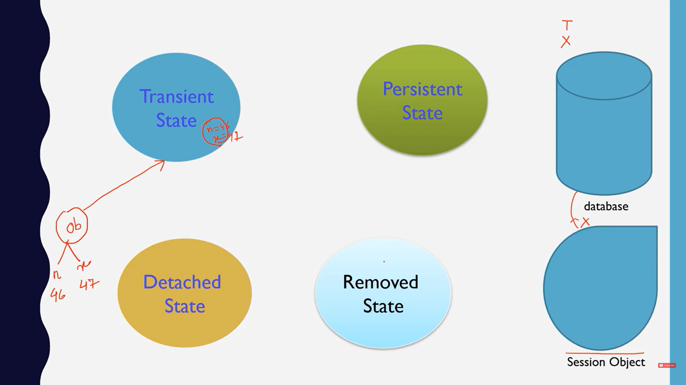 

```
// Creating a new object in the transient state
Employee employee = new Employee();
employee.setName("John");
employee.setAge(30);
```

2. Persistent State
	- When an object is associated with a Hibernate session, it enters the persistent state. In this state, the object is associated with a specific Hibernate session and is actively managed by Hibernate. Any changes made to the object will be tracked by Hibernate and will be persisted to the database when the session is flushed.
	- While an entity is in the persistent state, any changes made to it are automatically synchronized with the database at the end of the transaction or session flush.

```
Session session = sessionFactory.openSession();
session.beginTransaction();
session.save(student); // student is now in the persistent state
student.setAge(26);    // The change is tracked and will be updated in the database
session.getTransaction().commit(); 
session.close();

```

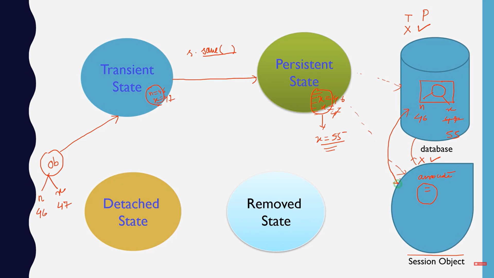

3. Detached State
	- An entity becomes detached when the Hibernate session that was managing it is closed or the entity is explicitly evicted from the session. While in the detached state, the entity is no longer synchronized with the database; any changes made to it are not automatically saved.
	- This means that the object is no longer actively managed by Hibernate, and any changes made to it will not be persisted to the database. However, the object is still a valid Java object and can be re-associated with a Hibernate session in the future.
	- The object is saved in database but it is no longer present in session, but if we made changes again using session update method we can save the updated value.

```
// Loading an existing object into a Hibernate session
Session session = HibernateUtil.getSessionFactory().openSession();
Employee employee = session.get(Employee.class, 1L); 

// Detaching the object from the Hibernate session
session.evict(employee);  
or
session.close();

// Modifying the object in the Detached state
employee.setAge(35); 

// Re-associating the object with a Hibernate session
session.beginTransaction();
session.update(employee);
```

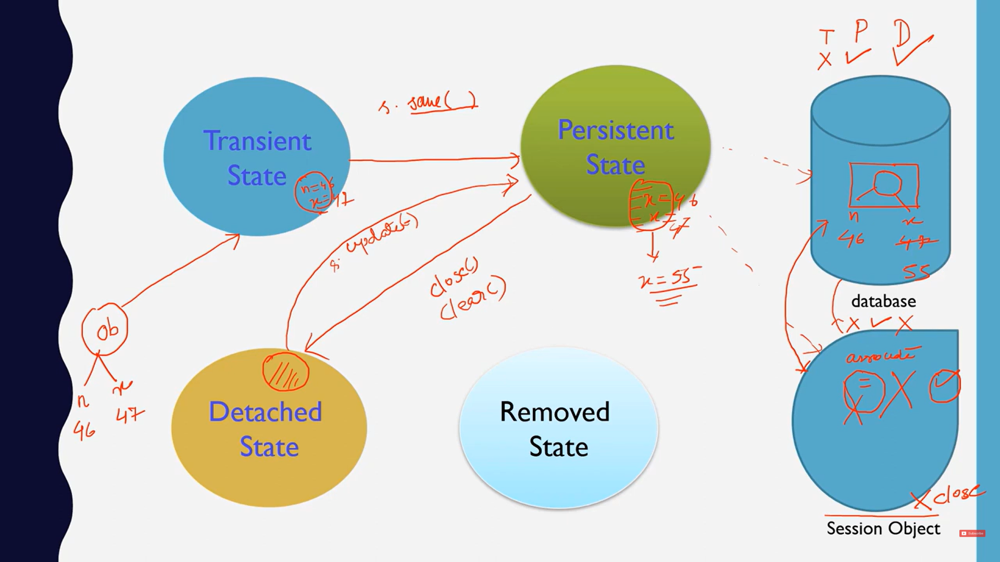


4. Removed State
	- The removed state is a transitional phase where the entity is marked for deletion but the actual removal from the database only occurs later, typically when the transaction is committed.
	- Basically we need to delete a row.

```
// Open a session and begin a transaction
Session session = sessionFactory.openSession();
session.beginTransaction();

// Load an entity (e.g., a Student)
Student student = session.get(Student.class, studentId);

// Mark the entity for deletion
session.delete(student); // Entity is now in the removed state

// Commit the transaction
session.getTransaction().commit();
session.close();
```


### HQL (Hibernate Query Language)

- Hibernate Query Language (HQL) is same as SQL (Structured Query Language) but it doesn't depends on the table of the database. Instead of table name, we use class name in HQL.
- Lets say you are migrating your database from Oracle to MySQL and you have been using HQL, do you require to do any code level changes (except configuration) ? absolutely no, because HQL is designed to be database-agnostic, meaning it doesn't rely on the specific details of the underlying database. Instead of writing SQL queries directly for a specific database (like MySQL, PostgreSQL, Oracle, etc.), you write HQL queries using the entity class names and their properties. Hibernate then translates these HQL queries into the appropriate SQL for the specific database being used.
- **That's why HQL is database independent**.
- Since we can switch database, the code can be easily moved and run on different systems or environments with minimal changes. This makes HQL portable.
- Consider an example of SQL, `select * from Student where age='eighteen'`. Now if the age defined in the student table is an integer it will thrown an SQL error. 
- Such mistakes can be avoided by HQL because it works with the Java class model, so the queries you write are checked against the entity classes you define.
- Example, we would have Student class and an int primitive datatype defined for age variable. Now when we run HQL query it checks the type safety first before executing the SQL, it means HQL expects an integer, not a string, for the age property which will thrown an error.
- HQL supports polymorphic queries.
- Lets fetch some values from database using multiple where clause.

```
package orm.hibernate.hql;

import java.util.ArrayList;
import java.util.List;

import org.hibernate.Session;
import org.hibernate.SessionFactory;
import org.hibernate.cfg.Configuration;
import org.hibernate.query.Query;

import orm.hibernate.annotation.Student;

public class MainMethod {

	public static void main(String[] args) {
		  /**
		   * This line creates a new instance of the Configuration class from Hibernate.
		   * The Configuration object is used to configure Hibernate and set up its properties.
		   */
		  Configuration con=new Configuration();
		  
		  /**
		   * This line tells the Configuration object to load the configuration settings from the file
		   *  hibernateConfig.cfg.xml, located in the orm/hibernate directory.
		   * The XML file contains important settings such as database connection details, dialect, 
		   *  mappings, and other Hibernate configurations.
		   */
		  con.configure("orm/hibernate/hibernateConfig.cfg.xml");
	  
		  /**
		   * The SessionFactory is a crucial object in Hibernate. It is a factory for Session objects, 
		   * which are used to interact with the database. The SessionFactory is typically created once 
		   * and used to create multiple Session instances.
		   */
		  SessionFactory ssf=con.buildSessionFactory();
		  
		  /**
		   * Created a session
		   */
		  Session session=ssf.openSession();
		  
		  //HQL
		  /**
		   * When are selecting all columns , we don't need to specify SELECT key word
		   * when are selecting few columns , we do need to specify SELECT key word
		   * 
		   * Here Student is my Object class name, whereas in my database
		   * Student_data is the table created
		   * st here is alias
		   */
		  String hqlQuery="from Student st where st.name=:x";
		  
		  Query query=session.createQuery(hqlQuery);
		  query.setParameter("x", "Harsh");
		  List<Student> studentList=query.list();
		  for(Student e: studentList) {
			  System.out.println(e.getId());
		  }
		  
		  
	}

}

Output:
Hibernate: 
    select
        s1_0.id,
        s1_0.city,
        s1_0.name 
    from
        Student_data s1_0 
    where
        s1_0.name=?
1
```

- Below are some update and delete operation example

```
package orm.hibernate.hql;

import java.util.ArrayList;
import java.util.List;

import org.hibernate.Session;
import org.hibernate.SessionFactory;
import org.hibernate.Transaction;
import org.hibernate.cfg.Configuration;
import org.hibernate.query.Query;

import orm.hibernate.annotation.Student;

public class MainMethod {

	public static void main(String[] args) {
		  /**
		   * This line creates a new instance of the Configuration class from Hibernate.
		   * The Configuration object is used to configure Hibernate and set up its properties.
		   */
		  Configuration con=new Configuration();
		  
		  /**
		   * This line tells the Configuration object to load the configuration settings from the file
		   *  hibernateConfig.cfg.xml, located in the orm/hibernate directory.
		   * The XML file contains important settings such as database connection details, dialect, 
		   *  mappings, and other Hibernate configurations.
		   */
		  con.configure("orm/hibernate/hibernateConfig.cfg.xml");
	  
		  /**
		   * The SessionFactory is a crucial object in Hibernate. It is a factory for Session objects, 
		   * which are used to interact with the database. The SessionFactory is typically created once 
		   * and used to create multiple Session instances.
		   */
		  SessionFactory ssf=con.buildSessionFactory();
		  
		  /**
		   * Created a session
		   */
		  Session session=ssf.openSession();
		  
		  //HQL
		  /**
		   * When are selecting all columns , we don't need to specify SELECT key word
		   * when are selecting few columns , we do need to specify SELECT key word
		   * 
		   * Here Student is my Object class name, whereas in my database
		   * Student_data is the table created
		   * st here is alias
		   */
		  String hqlQuery="from Student st where st.name=:x";
		  
		  /**
		   * Query is an interface
		   */
		  Query query=session.createQuery(hqlQuery);
		  query.setParameter("x", "Harsh");
		  List<Student> studentList=query.list();
		  for(Student e: studentList) {
			  System.out.println(e.getId());
		  }
		  
		  
		  /**
		   * Update,Delete and Join operation
		   */
		  
		  /**
		   * Using session we created a new transaction
		   */
		  Transaction tx=session.beginTransaction();
		  hqlQuery=" update Student set id=:n where name=:x";
		  query=session.createQuery(hqlQuery);
		  query.setParameter("n", 2);
		  query.setParameter("x", "Harsh");
		  int rowsaffected=query.executeUpdate();
		  System.out.println("Updated Rows - "+rowsaffected);
		  
		  
		  hqlQuery=" delete from Student where name=:x";
		  query=session.createQuery(hqlQuery);
		  query.setParameter("x", "Harsh");
		  rowsaffected=query.executeUpdate();
		  System.out.println("Deleted Rows - "+rowsaffected);
		  
		  tx.commit();
		  session.close();
		  
	}

}

Output:
Hibernate: 
    select
        s1_0.id,
        s1_0.city,
        s1_0.name 
    from
        Student_data s1_0 
    where
        s1_0.name=?
2
Hibernate: 
    update
        Student_data s1_0 
    set
        id=? 
    where
        s1_0.name=?
Updated Rows - 1
Hibernate: 
    delete s1_0 
    from
        Student_data s1_0 
    where
        s1_0.name=?
Deleted Rows - 1
```

- Joined Operation, is peformed on relational entities which are One-to-One, One-to-Many or Many-to-Many.
- We have Personal class which uses 

```
package orm.hibernate.hql;

import java.util.ArrayList;
import java.util.List;

import org.hibernate.Session;
import org.hibernate.SessionFactory;
import org.hibernate.Transaction;
import org.hibernate.cfg.Configuration;
import org.hibernate.query.Query;

import orm.hibernate.annotation.Student;
import orm.hibernate.annotation.onetoone.Personal;

public class MainMethod {

	public static void main(String[] args) {
		  /**
		   * This line creates a new instance of the Configuration class from Hibernate.
		   * The Configuration object is used to configure Hibernate and set up its properties.
		   */
		  Configuration con=new Configuration();
		  
		  /**
		   * This line tells the Configuration object to load the configuration settings from the file
		   *  hibernateConfig.cfg.xml, located in the orm/hibernate directory.
		   * The XML file contains important settings such as database connection details, dialect, 
		   *  mappings, and other Hibernate configurations.
		   */
		  con.configure("orm/hibernate/hibernateConfig.cfg.xml");
	  
		  /**
		   * The SessionFactory is a crucial object in Hibernate. It is a factory for Session objects, 
		   * which are used to interact with the database. The SessionFactory is typically created once 
		   * and used to create multiple Session instances.
		   */
		  SessionFactory ssf=con.buildSessionFactory();
		  
		  /**
		   * Created a session
		   */
		  Session session=ssf.openSession();
		  
		  //HQL
		  String hqlQuery="select psl.firstname,psl.lastname,prl.payrate from Personal as psl inner join psl.personalEmployeesPayroll as prl";

		  /**
		   * In Joined Operation, here we use OneToOne mapping relation where payroll
		   * is a part of Personal, so using Personal instance variable
		   * we will perform join operation.
		   * psl.personalEmployeesPayroll refers to the relationship field in the Personal entity that maps to the Payroll entity. This assumes that Personal has a property named payroll which is associated with a Payroll entity.
		   */
		  Query query=session.createQuery(hqlQuery);
		  
		  List<Object[]> joinResult=query.list();
		  for(Object[] obj: joinResult) {
			  System.out.println(obj[0]+" "+obj[1]+" "+obj[2]);
		  }
		  session.close();
		  
	}

}

Output:
Hibernate: 
    select
        p1_0.firstname,
        p1_0.lastname,
        p1_0.foreignkey_payroll_payrate 
    from
        one_to_one_personal p1_0 
    join
        one_to_one_payroll pep1_0 
            on pep1_0.payrate=p1_0.foreignkey_payroll_payrate
Harsh Pandya 1000.0
```

- Lets say we wanted to fetch limited number of rows but from row number 20 or something. In HQL we have a concept of paginator for this.
- Post execution of main method, we can see Output.

```
package orm.hibernate.hql;

import java.util.ArrayList;
import java.util.List;

import org.hibernate.Session;
import org.hibernate.SessionFactory;
import org.hibernate.Transaction;
import org.hibernate.cfg.Configuration;
import org.hibernate.query.Query;

import orm.hibernate.annotation.Student;
import orm.hibernate.annotation.onetoone.Personal;

public class MainMethod {

	public static void main(String[] args) {
		  /**
		   * This line creates a new instance of the Configuration class from Hibernate.
		   * The Configuration object is used to configure Hibernate and set up its properties.
		   */
		  Configuration con=new Configuration();
		  
		  /**
		   * This line tells the Configuration object to load the configuration settings from the file
		   *  hibernateConfig.cfg.xml, located in the orm/hibernate directory.
		   * The XML file contains important settings such as database connection details, dialect, 
		   *  mappings, and other Hibernate configurations.
		   */
		  con.configure("orm/hibernate/hibernateConfig.cfg.xml");
	  
		  /**
		   * The SessionFactory is a crucial object in Hibernate. It is a factory for Session objects, 
		   * which are used to interact with the database. The SessionFactory is typically created once 
		   * and used to create multiple Session instances.
		   */
		  SessionFactory ssf=con.buildSessionFactory();
		  
		  /**
		   * Created a session
		   */
		  Session session=ssf.openSession();
		  
		  /**
		   * Begin transaction
		   */
		  Transaction tx=session.beginTransaction();
		  
		  String hqlQuery="";
		  Query query=null;
		  
		  for (int i = 1; i < 201; i++) {
			  Paginator pg=new Paginator();
			  pg.setIdval("value "+i);
			  session.save(pg);
	    	  tx.commit();
			  tx.begin();
	    	  /**
	    	   * Whenever we commit, transaction gets completed
	    	   * so we need to again start the transaction
	    	   */
		  }
		  
		  hqlQuery=" from Paginator";
		  query=session.createQuery(hqlQuery);
		  query.setFirstResult(100); // Starting from which row
		  query.setMaxResults(10); // fetch 10 values
		  
		  List<Paginator> fetchAll=query.list();
		  
		  for(Paginator objf:fetchAll) {
			  System.out.println(objf.getId());
		  }
		  
		  session.close();
		  
		  
	}

}

Output:
101
102
103
104
105
106
107
108
109
110
```

- We can also execute normal sql queries or native queries.

```
package orm.hibernate.hql;

import java.util.ArrayList;
import java.util.List;

import org.hibernate.Session;
import org.hibernate.SessionFactory;
import org.hibernate.Transaction;
import org.hibernate.cfg.Configuration;
import org.hibernate.query.NativeQuery;
import org.hibernate.query.Query;

import orm.hibernate.annotation.Student;
import orm.hibernate.annotation.onetoone.Personal;

public class MainMethod {

	public static void main(String[] args) {
		  /**
		   * This line creates a new instance of the Configuration class from Hibernate.
		   * The Configuration object is used to configure Hibernate and set up its properties.
		   */
		  Configuration con=new Configuration();
		  
		  /**
		   * This line tells the Configuration object to load the configuration settings from the file
		   *  hibernateConfig.cfg.xml, located in the orm/hibernate directory.
		   * The XML file contains important settings such as database connection details, dialect, 
		   *  mappings, and other Hibernate configurations.
		   */
		  con.configure("orm/hibernate/hibernateConfig.cfg.xml");
	  
		  /**
		   * The SessionFactory is a crucial object in Hibernate. It is a factory for Session objects, 
		   * which are used to interact with the database. The SessionFactory is typically created once 
		   * and used to create multiple Session instances.
		   */
		  SessionFactory ssf=con.buildSessionFactory();
		  
		  /**
		   * Created a session
		   */
		  Session session=ssf.openSession();
		  
		  /**
		   * Begin transaction
		   */
		  Transaction tx=session.beginTransaction();
		  
		  /**
		   * Executing Native Queries
		   */
		  
		  String sqlQuery="select * from one_to_one_personal";
		  NativeQuery nq=session.createNativeQuery(sqlQuery);
		  List<Object[]> nativeList=nq.list();
		  for(Object[] objn:nativeList) {
			  System.out.println(objn[0]+" "+objn[1]);
		  }
		  
		  session.close();

	}

}

Output:
Hibernate: 
    select
        * 
    from
        one_to_one_personal
1 1000.0
```

### Caching in Hibernate

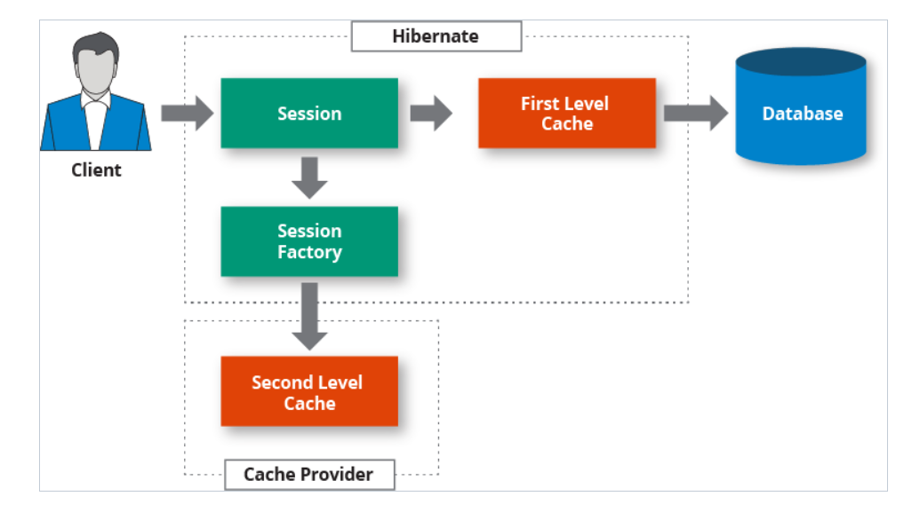

- In Hibernate, caching refers to storing objects or entities in a memory-based storage, known as a cache, to reduce the number of database queries. This cached data is kept in memory, which allows Hibernate to quickly access it without querying the database again.
- The main purpose of caching is to improve performance by minimizing the need to repeatedly fetch the same data from the database, which can be time-consuming and resource-intensive.
- There are two levels of caching

| Feature                     | First-Level Cache (Session Cache)                            | Second-Level Cache (SessionFactory Cache)                  |
|-----------------------------|---------------------------------------------------------------|--------------------------------------------------------------|
| **Scope**                   | Limited to a single Hibernate `Session`.                    | Shared across multiple Hibernate `Session` instances.       |
| **Configuration**            | Automatically enabled; no configuration needed.              | Requires explicit configuration and setup.                 |
| **Lifetime**                | Exists only during the lifecycle of the session. Won't be applicable when session is closed             | Persists across sessions and transactions.                 |
| **Usage**                   | Caches entities within the session's scope.                  | Caches entities, collections, and query results globally.   |
| **Memory Management**       | Managed automatically by Hibernate; cleared when session ends. | Must be managed carefully to avoid memory bloat; requires proper cache management. |
| **Performance Impact**      | Reduces database hits within a single session, improving performance for repeated entity access. | Reduces database hits across multiple sessions, beneficial for read-heavy applications. |
| **Cache Providers**         | Not applicable; managed internally by Hibernate.             | Can use various cache providers like EHCache, Infinispan, etc. |
| **Consistency**             | Provides consistency within the session but not across sessions. | Requires careful management to maintain consistency across different sessions. |
| **Typical Use Case**        | Managing entities within a single session for improved performance. | Caching frequently accessed data across sessions to reduce overall database load. |
| **Eviction Strategy**       | Automatically cleared when the session is closed.            | Requires manual eviction policies or strategies based on cache provider settings. |
| **Example Configuration**   | Not applicable; automatic.                                   | Example: `<property name="hibernate.cache.use_second_level_cache">true</property>` |

- Let us implement first level of caching

```
package orm.hibernate.caching;

import org.hibernate.Session;
import org.hibernate.SessionFactory;
import org.hibernate.cfg.Configuration;

import orm.hibernate.annotation.Student;

public class FirstLevel {

	  public static void main(String[] args) {

		  /**
		   * This line creates a new instance of the Configuration class from Hibernate.
		   * The Configuration object is used to configure Hibernate and set up its properties.
		   */
		  Configuration con=new Configuration();
		  
		  /**
		   * This line tells the Configuration object to load the configuration settings from the file
		   *  hibernateConfig.cfg.xml, located in the orm/hibernate directory.
		   * The XML file contains important settings such as database connection details, dialect, 
		   *  mappings, and other Hibernate configurations.
		   */
		  con.configure("orm/hibernate/hibernateConfig.cfg.xml");
	  
		  /**
		   * The SessionFactory is a crucial object in Hibernate. It is a factory for Session objects, 
		   * which are used to interact with the database. The SessionFactory is typically created once 
		   * and used to create multiple Session instances.
		   */
		  SessionFactory ssf=con.buildSessionFactory();
		  
		  /**
		   * Created a session
		   */
		  Session session=ssf.openSession();
		  
		  Student st=session.get(Student.class, 1);
		  System.out.println(st.getName());
		  System.out.println("Performing some other operation");
		  System.out.println("Again need to access Student class");
		  Student st1=session.get(Student.class, 1);
		  System.out.println(st1.getName());
		  System.out.println("Check if the object exists in Session Object");
		  System.out.println(session.contains(st1));
		  
		  session.clear();
		  
		  System.out.println("Closed Session");
		  System.out.println("Check if the object exists in Session Object");
		  System.out.println(session.contains(st1));
	  }
}


Output:
Hibernate: 
    select
        s1_0.id,
        s1_0.city,
        s1_0.name 
    from
        Student_data s1_0 
    where
        s1_0.id=?
Harsh
Performing some other operation
Again need to access Student class
Harsh
Check if the object exists in Session Object
true
Closed Session
Check if the object exists in Session Object
false
```

- If we observe the output, hibernate query got executed once and the entity is stored in the session object. Post clearing session entity does not exist anymore.
- Lets us implement second level caching using a provider name EhCache (Easy Hibernate Cache) which is an open source. So before implementing we need to tell hibernate that we also want second level of caching. To do this we need to do some configuration in cfg xml.

```
<?xml version="1.0" encoding="UTF-8"?>
<!DOCTYPE hibernate-configuration SYSTEM 
"http://www.hibernate.org/dtd/hibernate-configuration-3.0.dtd">
<!-- Version 8 MySQL hiberante-cfg.xml example for Hibernate 5 -->
<hibernate-configuration>
  <session-factory>
  <!-- Driver name -->
    <property name="connection.driver_class">com.mysql.cj.jdbc.Driver</property>
    <!-- property name="connection.driver_class">com.mysql.jdbc.Driver</property -->
    <property name="connection.url">jdbc:mysql://localhost:3306/myhibernatedb</property>
    <!-- 
    a "dialect" is a configuration setting that specifies the type of database you are using. 
    It tells Hibernate how to generate the appropriate SQL statements for your particular database system,
     as different databases have different SQL syntax, data types, and functions.
     -->
    <property name="dialect">org.hibernate.dialect.MySQLDialect</property>
    <property name="connection.username">root</property>
    <property name="connection.password">Meetpandya40@</property>
<!--     <property name="connection.pool_size">3</property>
 -->    <!--property name="dialect">org.hibernate.dialect.MySQLDialect</property-->
<!--     <property name="current_session_context_class">thread</property>
 -->    
 	<!-- 
 	show sql =  true states that whatever hibernate fires the query it will show in the console.
 	 -->
    <property name="show_sql">true</property>
    <property name="format_sql">true</property>
    
    <!-- 
    When we use create , it will create table , but if existing tables are there those will get deleted
    and again will get created. So it is better to use update over create. It will create only once if
    table does not exists.
     -->
    <property name="hbm2ddl.auto">update</property>
    
     <!-- Second Level Cache provider configurations -->
     <!-- by default second level cache is false -->
    <property name="hibernate.cache.use_second_level_cache">true</property>
    
    <!-- Post enabling second level cache we need to provide provider name for second level cache -->
    <property name="hibernate.cache.region.factory_class">
        org.hibernate.cache.ehcache.EhCacheRegionFactory
    </property>
    
    <!-- mapping class="com.mcnz.jpa.examples.Player" / -->
    <mapping class="orm.hibernate.annotation.Student"/>
    <mapping class="orm.hibernate.annotation.Address"/>
    <mapping class="orm.hibernate.annotation.Employee"/>
    <mapping class="orm.hibernate.annotation.onetoone.Personal" />
    <mapping class="orm.hibernate.annotation.onetoone.Payroll" /> 
     <mapping class="orm.hibernate.annotation.onetomany.Customer" />
    <mapping class="orm.hibernate.annotation.onetomany.CustomerOrder" />
   <mapping class="orm.hibernate.annotation.manytomany.EmployeeProjects" />
    <mapping class="orm.hibernate.annotation.manytomany.Projects" />    
    <mapping class="orm.hibernate.hql.Paginator" />    
  </session-factory>
</hibernate-configuration>
```
- **Ensure that the hibernate-core version and hibernate-ehcache version are same**.

```
<dependency>
    <groupId>org.hibernate</groupId>
    <artifactId>hibernate-core</artifactId>
    <version>5.6.5.Final</version>
</dependency>


<!-- https://mvnrepository.com/artifact/com.mysql/mysql-connector-j -->
<dependency>
    <groupId>com.mysql</groupId>
    <artifactId>mysql-connector-j</artifactId>
    <version>8.0.33</version>
</dependency>

<!-- https://mvnrepository.com/artifact/org.hibernate/hibernate-ehcache -->
<dependency>
    <groupId>org.hibernate</groupId>
    <artifactId>hibernate-ehcache</artifactId>
    <version>5.6.5.Final</version>
</dependency>

<!-- https://mvnrepository.com/artifact/net.sf.ehcache/ehcache -->
<dependency>
    <groupId>net.sf.ehcache</groupId>
    <artifactId>ehcache</artifactId>
    <version>2.10.9.2</version>
</dependency>
```

- Here we have enabled second level of caching and told hibernate the second level cache will be done by EhCache. Now by default not all entities are applicable for second level of caching, we need to explicity mentioned that the particular entity will be applicable for second level of caching, which is done by `@@Cacheable` and `@Cache(usage = CacheConcurrencyStrategy.READ_WRITE)`. 

```
package orm.hibernate.annotation;

import org.hibernate.annotations.Cache;
import org.hibernate.annotations.CacheConcurrencyStrategy;

import javax.persistence.Cacheable;
import javax.persistence.Entity;
import javax.persistence.Id;
import javax.persistence.Table;

/**
 * Applicable for second level of caching,
 * READ_WRITE states that this entity will be having
 * read as well as write operation.
 */
@Entity
@Table(name="Student_data")
@Cacheable
@Cache(usage = CacheConcurrencyStrategy.READ_WRITE)
public class Student {
	
	@Id
	private int id;
	
	private String name;
	private String city;
	
	public int getId() {
		return id;
	}
	public void setId(int id) {
		this.id = id;
	}
	public String getName() {
		return name;
	}
	public void setName(String name) {
		this.name = name;
	}
	public String getCity() {
		return city;
	}
	public void setCity(String city) {
		this.city = city;
	}
	
	@Override
	public String toString() {
		return "Student [id=" + id + ", name=" + name + ", city=" + city + "]";
	}
	
	
	
}
```

- Post execution of main method, we can see the output.

```
package orm.hibernate.caching;

import org.hibernate.Session;
import org.hibernate.SessionFactory;
import org.hibernate.cfg.Configuration;

import orm.hibernate.annotation.Student;

public class SecondLevel {


	  public static void main(String[] args) {

		  /**
		   * This line creates a new instance of the Configuration class from Hibernate.
		   * The Configuration object is used to configure Hibernate and set up its properties.
		   */
		  Configuration con=new Configuration();
		  
		  /**
		   * This line tells the Configuration object to load the configuration settings from the file
		   *  hibernateConfig.cfg.xml, located in the orm/hibernate directory.
		   * The XML file contains important settings such as database connection details, dialect, 
		   *  mappings, and other Hibernate configurations.
		   */
		  con.configure("orm/hibernate/hibernateConfig.cfg.xml");
	  
		  /**
		   * The SessionFactory is a crucial object in Hibernate. It is a factory for Session objects, 
		   * which are used to interact with the database. The SessionFactory is typically created once 
		   * and used to create multiple Session instances.
		   */
		  SessionFactory ssf=con.buildSessionFactory();
		  
		  /**
		   * Created 2 sessions
		   */
		  System.out.println("Created Session 1");
		  Session session1=ssf.openSession();
		  
		  /** 
		   * Executed query in session1 
		   */
		  Student st=session1.get(Student.class, 1);
		  
		  System.out.println(st.getName());
		  System.out.println("Shared arcoss multiple sessions");
		  session1.close();
		  System.out.println("Closed Session 1");
		  System.out.println("Created Session 2");
		  Session session2=ssf.openSession();
		  Student st2=session2.get(Student.class, 1);
		  System.out.println("Query not again got executed we retrieve values from cache");
		  System.out.println(st2.getName());

	  }

}

Output:
Created Session 1
Hibernate: 
    select
        student0_.id as id1_10_0_,
        student0_.city as city2_10_0_,
        student0_.name as name3_10_0_ 
    from
        Student_data student0_ 
    where
        student0_.id=?
Harsh
Shared arcoss multiple sessions
Closed Session 1
Created Session 2
Query not again got executed we retrieve values from cache
Harsh
```

- Here once session is created the data is shared between multiple session and we were able to retrieve the values.
- Lets see how HQL second level cache can be done using `Query`. To do it we need to add one more configuration.

```
    
    <!-- second level cache enable for query -->
    <property name="hibernate.cache.use_query_cache">true</property>
    
```

- Lets execute the main method and see.

```
package orm.hibernate.caching;

import org.hibernate.Session;
import org.hibernate.SessionFactory;
import org.hibernate.cfg.Configuration;
import org.hibernate.query.Query;

import orm.hibernate.annotation.Student;

public class SecondLevel {


	  public static void main(String[] args) {

		  /**
		   * This line creates a new instance of the Configuration class from Hibernate.
		   * The Configuration object is used to configure Hibernate and set up its properties.
		   */
		  Configuration con=new Configuration();
		  
		  /**
		   * This line tells the Configuration object to load the configuration settings from the file
		   *  hibernateConfig.cfg.xml, located in the orm/hibernate directory.
		   * The XML file contains important settings such as database connection details, dialect, 
		   *  mappings, and other Hibernate configurations.
		   */
		  con.configure("orm/hibernate/hibernateConfig.cfg.xml");
	  
		  /**
		   * The SessionFactory is a crucial object in Hibernate. It is a factory for Session objects, 
		   * which are used to interact with the database. The SessionFactory is typically created once 
		   * and used to create multiple Session instances.
		   */
		  SessionFactory ssf=con.buildSessionFactory();

		  
		  System.out.println("New session created");
		  String hqlQuery="from Student where id=1";
		  Session session=ssf.openSession();
		  Query q1=session.createQuery(hqlQuery);
		  
		  /**
		   * First time we are storing value in the cache 
		   */
		  q1.setCacheable(true);
		  Student st3=(Student) q1.uniqueResult();
		  System.out.println(st3.getName());
		  System.out.println("Shared between multiple sessions");
		  session.close();
		  
		  
		  System.out.println("Session closed");
		  System.out.println("New session created");
		  Session session3=ssf.openSession();
		  Query q2=session3.createQuery(hqlQuery);
		  
		  /**
		   * Second time we are fetching value from the cache 
		   */
		  q2.setCacheable(true);
		  Student st4=(Student) q2.uniqueResult();
		  System.out.println(st4.getName());

	  }

}


Output:
New session created
Hibernate: 
    select
        student0_.id as id1_10_,
        student0_.city as city2_10_,
        student0_.name as name3_10_ 
    from
        Student_data student0_ 
    where
        student0_.id=1
Harsh
Shared between multiple sessions
Session closed
New session created
Harsh
```

### XML Based Mapping

- Hibernate provides us two approach, annotation based configuration or XML based configuration.
- Lets see an example of XML based configuration.
- Suppose we have a class of coders which is simple POJO class.

```
package orm.hibernate.xmlbasedconfig;

public class Coders {

	private int id;
	private String name;
	private float rating;
	
	public int getId() {
		return id;
	}
	public void setId(int id) {
		this.id = id;
	}
	public String getName() {
		return name;
	}
	public void setName(String name) {
		this.name = name;
	}
	public float getRating() {
		return rating;
	}
	public void setRating(float rating) {
		this.rating = rating;
	}
	
	
}
``` 

- To define mapping of this pojo class with database table we need to create a xml file with extension as **hbm.xml**. So here we have **Coders.hbm.xml** file which has mapping between entity Coder class and database columns.

```
<?xml version="1.0"?>
<!DOCTYPE hibernate-mapping PUBLIC "-//Hibernate/Hibernate Mapping DTD 3.0//EN"
"http://www.hibernate.org/dtd/hibernate-mapping-3.0.dtd">

<hibernate-mapping>
    <class name="orm.hibernate.xmlbasedconfig.Coders" table="coders_information">
        <id name="id" column="coder_id">
            <generator class="identity"/>
        </id>
        <property name="name" column="coder_username"/>
        <property name="rating" column="coder_rating"/>
    </class>
</hibernate-mapping>

```

- Currently there are no tables with name coders_information


- So we have defined hbm file and we have created a pojo class, now lets us define hibernate configuration file.

```
<?xml version="1.0" encoding="UTF-8"?>
<!DOCTYPE hibernate-configuration SYSTEM 
"http://www.hibernate.org/dtd/hibernate-configuration-3.0.dtd">
<!-- Version 8 MySQL hiberante-cfg.xml example for Hibernate 5 -->
<hibernate-configuration>
  <session-factory>
  <!-- Driver name -->
    <property name="connection.driver_class">com.mysql.cj.jdbc.Driver</property>
    <!-- property name="connection.driver_class">com.mysql.jdbc.Driver</property -->
    <property name="connection.url">jdbc:mysql://localhost:3306/myhibernatedb</property>
    <!-- 
    a "dialect" is a configuration setting that specifies the type of database you are using. 
    It tells Hibernate how to generate the appropriate SQL statements for your particular database system,
     as different databases have different SQL syntax, data types, and functions.
     -->
    <property name="dialect">org.hibernate.dialect.MySQL8Dialect</property>
    <property name="connection.username">root</property>
    <property name="connection.password">Meetpandya40@</property>
<!--     <property name="connection.pool_size">3</property>
 -->    <!--property name="dialect">org.hibernate.dialect.MySQLDialect</property-->
<!--     <property name="current_session_context_class">thread</property>
 -->    
 	<!-- 
 	show sql =  true states that whatever hibernate fires the query it will show in the console.
 	 -->
    <property name="show_sql">true</property>
    <property name="format_sql">true</property>
    
    <!-- 
    When we use create , it will create table , but if existing tables are there those will get deleted
    and again will get created. So it is better to use update over create. It will create only once if
    table does not exists.
     -->
    <property name="hbm2ddl.auto">create</property>
    <mapping resource="orm/hibernate/xmlbasedconfig/Coders.hbm.xml" />
    
   </session-factory>
</hibernate-configuration>
```

- Lets execute the main method and see.

```
package orm.hibernate.xmlbasedconfig;

import org.hibernate.Session;
import org.hibernate.SessionFactory;
import org.hibernate.Transaction;
import org.hibernate.cfg.Configuration;

public class MainMethod {

	  public static void main(String[] args) {
		  /**
		   * This line creates a new instance of the Configuration class from Hibernate.
		   * The Configuration object is used to configure Hibernate and set up its properties.
		   */
		  Configuration con=new Configuration();
		  
		  /**
		   * This line tells the Configuration object to load the configuration settings from the file
		   *  hibernateConfig.cfg.xml, located in the orm/hibernate directory.
		   * The XML file contains important settings such as database connection details, dialect, 
		   *  mappings, and other Hibernate configurations.
		   */
		  con.configure("orm/hibernate/hibernateXmlBasedConfig.cfg.xml");
	  
		  /**
		   * The SessionFactory is a crucial object in Hibernate. It is a factory for Session objects, 
		   * which are used to interact with the database. The SessionFactory is typically created once 
		   * and used to create multiple Session instances.
		   */
		  SessionFactory ssf=con.buildSessionFactory();
		  
		  /**
		   * Created a session
		   */
		  Session session=ssf.openSession();
		  
		  Transaction tx=session.beginTransaction();
				  
		  
		  Coders code=new Coders();
		  code.setId(1);
		  code.setName("Harsh");
		  code.setRating(7);
		  
		  session.save(code);
		  tx.commit();
		  session.close();
		
		  
	  }
}


Output:
Hibernate: 
    
    create table coders_information (
       coder_id integer not null auto_increment,
        coder_username varchar(255),
        coder_rating float,
        primary key (coder_id)
    ) engine=InnoDB
Hibernate: 
    insert 
    into
        coders_information
        (coder_username, coder_rating) 
    values
        (?, ?)
```

- Below is the table output.

 

- Similarly in annotation we have defined several annotations , the same things is also provided by XML based mapping. Below are some examples.

	- `<hibernate-mapping>`: The root element in a Hibernate XML mapping file.
	- `<class>`: Maps a Java class to a database table. Annotation: @Entity, @Table
	- `<id>`: Maps the primary key property of the entity. Annotation: @Id, @GeneratedValue
	- `<property>`: Maps a simple property (field) of the entity to a column in the table. Annotation: @Column
	- `<many-to-one>`: Maps a many-to-one relationship between two entities. Annotation: @ManyToOne
	- `<one-to-many>`: Maps a one-to-many relationship between two entities. Annotation: @OneToMany
	- `<many-to-many>`: Maps a many-to-many relationship between two entities. Annotation: @ManyToMany
	- `<one-to-one>`: Maps a one-to-one relationship between two entities. Annotation: @OneToOne
	- `<component>`: Maps a component (embedded) class, which is a class with no identity of its own. Annotation: @Embeddable, @Embedded
	- `<join>`: Maps a secondary table or join to the main entity's table. Annotation: @SecondaryTable, @PrimaryKeyJoinColumn
	- `<key>`: Specifies the foreign key column in a collection mapping. Annotation: @JoinColumn (used in various collection mappings)
	- `<generator>`: Defines the strategy for generating primary key values. Annotation: @GeneratedValue


### When to use XML and Annotation?

- New Projects: Annotation-based mapping is generally preferred due to its simplicity and ease of maintenance.   
- Legacy Systems: If you're working with an existing XML-based project, it might be more practical to continue using XML to avoid extensive refactoring.
- Complex Mappings: For extremely complex mappings, XML-based mapping can offer more flexibility and control.
- Team Preferences: Consider the preferences and expertise of your team members when making a decision.

### Criteria API

- The XML and annotation-based approaches in Hibernate are primarily concerned with mapping Java classes to database tables and defining the relationships between them. On the other hand, HQL (Hibernate Query Language) and the Criteria API are tools provided by Hibernate for performing database operations like querying, updating, and deleting data.
- Criteria API is an object-oriented API provided by Hibernate for constructing database queries dynamically. It offers a type-safe and flexible way to build complex queries without writing raw SQL or HQL strings.
- Lets see an example, we have already define a class Paginator earlier which has around 200 rows. We want to retrieve values from it having some where clause and only specific column.

```
package orm.hibernate.criteria;

import java.util.List;

import org.hibernate.Criteria;
import org.hibernate.Session;
import org.hibernate.SessionFactory;
import org.hibernate.cfg.Configuration;
import org.hibernate.criterion.Projections;
import org.hibernate.criterion.Restrictions;

import orm.hibernate.hql.Paginator;

public class MainMethod {

	public static void main(String[] args) {
        // Get SessionFactory (Assuming you have a configured SessionFactory)
        SessionFactory sessionFactory = new Configuration().configure("orm/hibernate/hibernateConfig.cfg.xml").buildSessionFactory();
        Session session = sessionFactory.openSession();

        try {
            // Create a Criteria instance
            Criteria criteria = session.createCriteria(Paginator.class);

            // Add restrictions
            criteria.add(Restrictions.gt("id", 10)); // Id greater than 30000
            criteria.add(Restrictions.ilike("idval", "%value%")); //idval like '%value%'
            // Add projections
            criteria.setProjection(Projections.projectionList()
                    .add(Projections.sum("id"), "sumOfId")); // sum(id)

            // Execute the query
            Object results = criteria.uniqueResult();
            System.out.println("Sum of IDs - "+results);
        } catch (Exception e) {
            e.printStackTrace();
        } finally {
            session.close();
        }
	}

}


Output:
Hibernate: 
    select
        sum(this_.id) as y0_ 
    from
        Paginator this_ 
    where
        this_.id>? 
        and lower(this_.idval) like ?
Sum of IDs - 20246
```

- If you see, we have not written any queries, criteria api provides us in-build methods.
- Restrictions are used in the Criteria API to specify the conditions (or filters) that must be met for a query result. They allow you to define criteria such as "equal to," "greater than," "like," etc., to filter the data retrieved from the database.

- Projections are used to specify which columns or expressions should be selected in the query result. They allow you to select specific fields rather than entire entities, perform aggregate functions like count or sum, and create more customized query outputs.

#### How does it differ from HQL?
- Nature: HQL is a string-based query language similar to SQL, while Criteria API is an object-oriented API.
- Type Safety: Criteria API provides compile-time type safety, reducing the risk of runtime errors. HQL, being string-based, lacks this advantage. - Flexibility: Criteria API is more flexible for dynamic query building as it allows you to construct queries programmatically. HQL is better suited for static queries.   
- Performance: Generally, HQL is considered slightly faster than Criteria API due to its direct translation to SQL. However, the performance difference is often negligible in most real-world applications.

#### Why use Criteria API?
- Type Safety: Prevents runtime errors caused by incorrect property names or data types.   
- Flexibility: Ideal for dynamic query building based on user input or runtime conditions.   
- Readability: Can improve code readability compared to complex HQL strings.
- Object-Oriented Approach: Aligns better with Java's object-oriented paradigm.


